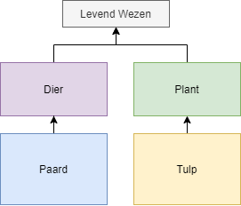
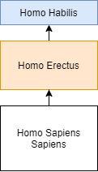
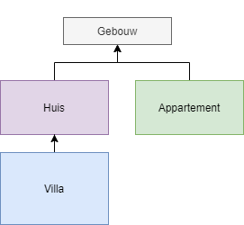
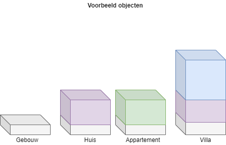
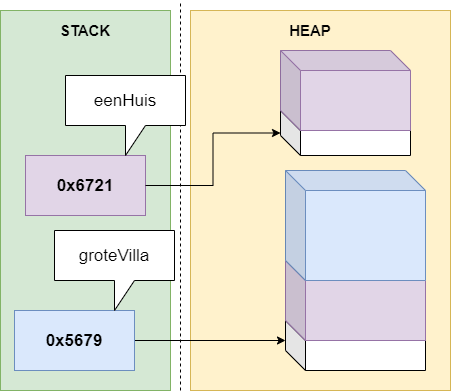
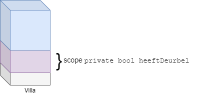

# Overerving

Programmeurs zijn luie wezens. Ieder concept dat hen toelaat minder code te schrijven zullen ze dan ook omarmen. Dubbele code wil namelijk ook zeggen dat er dubbel zoveel plekken zijn waar bugs kunnen optreden én die aangepast moeten worden wanneer de specificaties veranderen.

Indien 2 of meer klassen een aantal gelijkaardige stukken code hebben is er mogelijk een verband tussen die twee klassen. Denk maar aan de klassen ``Monster`` en ``Held`` in een avonturenspel. Beide klassen hebben vermoedelijk bepaalde properties en methoden die identiek, of bijna identiek zijn qua implementatie.

Wat we hier zien is het concept **overerving**. Beide klassen hebben duidelijk een soort gemeenschappelijke "voorouder". Net zoals in de natuur waar apen en mensen afstammen van een gemeenschappelijke voorouder, kan je dit concept ook in OO hebben. 

De zogenaamde "child-klasse" is de klasse die overerft van een "parent-klasse". Deze child-klasse zal een specialisatie zijn: het zal meer kunnen dan z'n parent. Ook in de natuur zien we dit: de homo sapiens sapiens (wij!) is evolutionair gezien een verbetering tegenover de homo erectus (kleinere hersenen) , die op zijn beurt een verbetering is van zijn voorouder, de homo habilis (kon nog niet op 2 ledematen rondwandelen).

Kijken we terug naar ``Monster`` en ``Held`` dan is het duidelijk dat een gemeenschappelijke parent-klasse misschien wel de klasse ``Karakter`` is.

Dankzij overerving kunnen we de gemeenschappelijk code van de child-klassen verhuizen naar deze parent-klasse. In de child-klassen,  zullen enkel nog de code bevatten die uniek is voor hen (de zogenaamde specialisatie).


Deze introductie doet uitschijnen dat overerving enkel z'n nut heeft om *dubbele code* te vermijden, wat niet zo is. Dubbele code vermijden dankzij overerving is eerder een gevolg ervan. Overerving is een erg krachtig concept dat in de komende hoofdstukken telkens zal terugkomen wanneer we gaan praten over polymorfisme, interfaces, etc.



## Wat is overerving
Overerving (**inheritance**) laat ons toe om klassen te specialiseren vanuit een reeds bestaande parent- of basisklasse. Wanneer we een klasse van een andere klasse overerven dan zeggen we dat deze nieuwe klasse een child-klasse of sub-klasse is van de bestaande parent-klasse of super-klasse.

De child-klasse kan alles wat de parent-klasse kan, maar de nieuwe klasse kan nu ook extra specialisatie code krijgen.


### Is-een relatie

Wanneer twee klassen met behulp van een "x is een y"-relatie kunnen beschreven worden dan weet je dat overerving mogelijk.

* Een paard **is een** dier (paard = child-klasse, dier= parent-klasse)
* Een tulp **is een** plant
* Zowel een een dier als een plant zijn levende wezens


Opgelet: wanneer we "x **heeft een** y" zeggen gaat het **niet** over overerving, maar over compositie wat we in een later hoofdstuk zullen bekijken. 




Het is niet omdat 2 klassen delen gelijkaardige (of dezelfde) code hebben dat hier dus automatisch overerving van toepassing is. Enkel indien er een realistische "is een"-relatie bestaat kan overerving toegepast worden.

Uiteraard is de kans wel groot dat er "een oplossing" voor je dubbele code is, zelfs wanneer er geen "is een"-relatie bestaat. Meestal beland je dan bij generics of compositie (zie verder) als oplossing van je probleem.


### Overerving beschrijven
In UML-notatie duiden we een overervings-relatie aan met een pijl van van de child- naar de parentklasse:



En als we het voorbeeld van de mens en z'n voorgangers nemen dan zou een vereenvoudigd UML-schema er als volgt uitzien:




## Overerving in C#

Overving in C# duid je aan met behulp van het dubbele punt(:) bij de klassedefinitie, als volgt

```java
class Paard : Dier
{
   public bool KanHinnikken{get;set;}
}

class Dier
{
   public void Eet()
   {
    //...
   }
}
```

Objecten van het type ``Dier`` kunnen enkel de ``Eet``-methode aanroepen. Objecten van het type ``Paard`` kunnen de ``Eet``-methode aanroepen én ze hebben ook een property ``KanHinnikken``:

```java
Dier aDier= new Dier();
Paard bPaard= new Paard();
aDier.Eet();
bPaard.Eet();
bPaard.KanHinnikken=false;
aDier.KanHinnikken=false; //!!! zal niet werken!
```

<!---NOBOOKSTART--->

<!---NOBOOKEND--->
<!---{aside}--->
<!--- {float:right, width:50%} --->

Ik heb weinig te doen. Dus nu begint de auteur mij al in te schakelen voor alternatieve uitleg. Ach ja, zolang ik brood op de plank leg zal m'n partner niet klagen!

Als we de "kennis" die in dit en het vorige boek zouden moeten programmeren, dan zou overerving ons ook kunnen helpen. Je kan dit boek onmogelijk begrijpen zonder de kennis van boek 1, Zie Scherp. Dus eigenlijk is dit boek een specialisatie van boek 1: de kennis van van boek 1 zit hierin vervat, maar wordt uitgebreid/gespecialiseerd met deze van boek 2.

We zouden dus kunnen schrijven:

```java
class KennisZieScherp
{

}

class KennisZieScherper: KennisZieScherp
{

}
```

Man, man, soms denk ik dat de auteur van beide boeken high wordt van z'n eigen code, wat een surreëel gezwam.
<!---{/aside}--->
<!---NOBOOKSTART--->

<!---NOBOOKEND--->


### Multiple inheritance

In C# is het niet mogelijk om een klasse van meer dan één parent-klasse te laten overerven (zogenaamde *multiple inheritance*), wat wel mogelijk is in sommige andere object georiënteerde talen.

### Transitief

Overerving in C# is transitief, dit wil zeggen dat de child-klasse ALLES overerft van de parent-klasse: methoden, properties, etc.

Dit kleine, korte zinnetje herbergt aardig wat kracht. Dankzij overerving kunnen we onze klasse dus erg proper (en kort) houden indien er een "is een" relatie bestaat. Er zijn echter ook enkele kanttekeningen aangaande overerving die we in de komende secties uit te doeken zullen doen. 

Alhoewel overerving transitief is, wil dat niet zeggen dat ``private`` variabelen plots zichtbaar zijn in de child-klasse. De child-klasse erft ALLES over, ook de ``private`` instantievariabelen, maar C# houdt zich wel aan de regels en zal voorkomen dat de child-code aan de parent instantievariabelen kan.


<!---NOBOOKSTART--->

<!---NOBOOKEND--->
<!---{aside}--->
<!--- {float:right, width:50%} --->


Tijd om eens te kijken hoe voorgaande er uitziet in de heap en de stack, met een onderwerp dat op m'n lijf geschreven is: een applicatie om aan gebouwbeheer te doen.

Beeld je in dat je volgende klassediagramma hebt vastgelegd:


De objecten in het geheugen zullen er dan als volgt uitzien:


Indien we nu 2 objecten aanmaken
```java
Huis eenHuis = new Huis();
Villa groteVilla = new Villa();
```
En vervolgens kijken we hoe dit er in het geheugen uitziet:



Ook hier zien we duidelijk dat dus een ``Villa`` object alle "code" in zich heeft die zowel in de klasse ``Villa`` staat (de specialisatie) alsook die waarvan wordt overgeërfd, ``Huis``. Bijgevolg heeft ``groteVilla`` dus ook de "code" van ``Gebouw`` bestaat in de villa dankzij de transitiviteits-eigenschap van overerving. 

Echter, de ``private`` delen van een klasse blijven beperkt tot dat stuk waar de variabele of methode origineel toe hoort. Als er dus in de klasse ``Huis`` een variabele ``private bool heeftDeurbel`` was, dan zal de code in de klasse ``Villa`` daar niet aan geraken:





<!---{/aside}--->
<!---NOBOOKSTART--->

<!---NOBOOKEND--->


### Protected

Ook al is overerving transitief, hou er rekening mee dat private variabelen en methoden van de parent-klasse NIET rechtstreeks aanroepbaar zijn in de child-klasse. Private geeft aan dat het element enkel in de klasse zichtbaar is:

```java
class Paard: Dier
{
   public void MaakOuder()
   {
      leeftijd++; //  !!! dit zal error geven!
   }
}

class Dier
{
   private int leeftijd;
}
```

Je kan dit oplossen door de **``protected``** access modifier ipv ``private`` te gebruiken. Met ``protected`` geef je aan dat het element enkel zichtbaar is binnen de klasse **en** binnen child-klassen:

```java
class Paard: Dier
{
   public void MaakOuder()
   {
      leeftijd++; //  werkt nu wel
   }
}

class Dier
{
   protected int leeftijd;
}
```

### Sealed

Soms wil je niet dat van een klasse nog nieuwe klassen kunnen overgeërfd worden. Je lost dit op door het keyword ``sealed`` voor de klasse te zetten:

```java
sealed class DoNotInheritMe
{
   //...
}
```

Als je later dan dit probeert:

```java
class ChildClass:DoNotInheritMe
{
   //...
}
```

zal dit resulteren in een foutboodschap, namelijk ``Cannot derive from sealed type 'DoNotInheritMe'``.

<!---NOBOOKSTART--->
# Kennisclip

* [Overerving overzicht](https://ap.cloud.panopto.eu/Panopto/Pages/Viewer.aspx?id=c8b828c5-87c0-4339-a61c-ab7c00aef24d)
<!---NOBOOKEND--->