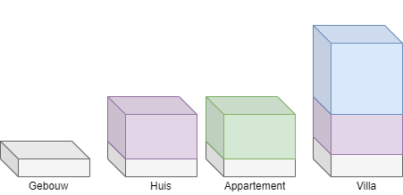

# Overerving

Programmeurs zijn luie wezens. Ieder concept dat hen toelaat minder code te schrijven zullen ze dan ook omarmen. Dubbele code wil nameljk ook zeggen dat er dubbel zoveel plekken zijn waar bugs kunnen optreden én die aangepast moeten worden wanneer de specificaties veranderen.

Totnogtoe hadden we echter nog geen oplossing voor code die zich herhaald in 2 (of meer) verschillende klassen.

Stel dat we volgende 2 best wel gelijkaardige klassen hebben

```java
class 
{
   
}

class
{

}
```



Deze introductie doet uitschijnen dat overerving enkel z'n nut heeft om *dubbele code* te vermijden, wat niet zo is. Dubbele code vermijden dankzij overerving is eerder een gevolg ervan. Overerving is een erg krachtig concept dat in de komende hoofdstukken telkens zal terugkomen wanneer we gaan praten over polymorfisme, interfaces, etc.



## Wat is overerving
Overerving (**inheritance**) laat ons toe om klassen te specialiseren vanuit een reeds bestaande basisklasse. Wanneer we een klasse van een andere klasse overerven dan zeggen we dat deze nieuwe klasse een child-klasse of sub-klasse is van de bestaande parent-klasse of super-klasse.

De child-klasse kan alles wat de parent-klasse kan, maar de nieuwe klasse kan nu ook extra specialisatie code krijgen.


## Is-een relatie

Wanneer twee klassen met behulp van een "x is een y"-relatie kunnen beschreven worden dan weet je dat overerving mogelijk.

* Een paard **is een** dier (paard = child-klasse, dier= parent-klasse)
* Een tulp **is een** plant



Opgelet: wanneer we "x heeft een y" zeggen gaat het **niet** over overerving, maar over [compositie](../14_compositie/0_compositie_intro.MD).




Het is niet omdat 2 klassen delen gelijkaardige (of dezelfde) code hebben dat hier dus automatisch overerving van toepassing is. Enkel indien er een realistische "is een"-relatie bestaat kan overerving toegepast worden.

Uiteraard is de kans wel groot dat er "een oplossing" voor je dubbele code is, zelfs wanneer er geen "is een"-relatie bestaat. Meestal beland je dan bij generics of compositie (zie verder) als oplossing van je probleem.


## Overerving in C#

Overving duid je aan met behulp van het dubbele punt(:)  bij de klassedefinitie:

Een voorbeeld:

```java
class Paard: Dier
{
   public bool KanHinnikken{get;set;}
}

class Dier
{
   public void Eet()
   {
    //...
   }
}
```

Objecten van het type ``Dier`` kunnen enkel de ``Eet``-methode aanroepen. Objecten van het type ``Paard`` kunnen de ``Eet``-methode aanroepen én ze hebben ook een property ``KanHinnikken``:

```java
Dier aDier= new Dier();
Paard bPaard= new Paard();
aDier.Eet();
bPaard.Eet();
bPaard.KanHinnikken=false;
aDier.KanHinnikken=false; //!!! zal niet werken!
```

### Multiple inheritance

In C# is het niet mogelijk om een klasse van meer dan één parent-klasse te laten overerven (zogenaamde *multiple inheritance*), wat wel mogelijk is in sommige andere object georiënteerde talen.

### Transitive

Overerving in C# is transitief, dit wil zeggen dat de child-klasse ALLES overerft van de parent-klasse: methoden, properties, etc.


<!---NOBOOKSTART--->

<!---NOBOOKEND--->
<!---{aside}--->
<!--- {float:right, width:50%} --->


Tijd om eens te kijken hoe voorgaande er uit ziet in de heap en de stack, met een onderwerp dat op m'n lijf geschreven is: een applicatie op aan gebouwbeheer te doen.

Beeld je in dat je volgende klassediagram hebt vastgelegd:


De objecten in het geheugen zullen er dan als volgt uitzien:


Indien we nu 2 objecten aanmaken
```java
Huis eenHuis = new Huis();
Villa groteVilla = new Villa();
```
En vervolgens kijken we hoe dit er in het geheugen uitziet:


Ook hier zien we duidelijk dat dus een ``Villa`` object alle "code" in zich heeft die zowel in de klasse ``Villa`` staat (de specialisatie) alsook die waarvan wordt overgeërfd, ``Huis``. Bijgevolg heeft ``groteVilla`` dus ook de "code" van ``Gebouw`` bestaat in de villa dankzij de transitiviteits-eigenschap van overerving.

<!---{/aside}--->
<!---NOBOOKSTART--->

<!---NOBOOKEND--->


### Protected

Ook al is overerving transitief, hou er rekening mee dat private variabelen en methoden van de parent-klasse NIET rechtsreeks aanroepbaar zijn in de child-klasse. Private geeft aan dat het element enkel in de klasse zichtbaar is:

```java
class Paard: Dier
{
   public void MaakOuder()
   {
      leeftijd++; //  !!! dit zal error geven!
   }
}

class Dier
{
   private int leeftijd;
}
```

Je kan dit oplossen door de **protected** access modifier ipv private te gebruiken. Met protected geef je aan dat het element enkel zichtbaar is binnen de klasse **en** binnen child-klassen:

```java
class Paard: Dier
{
   public void MaakOuder()
   {
      leeftijd++; //  werkt nu wel
   }
}

class Dier
{
   protected int leeftijd;
}
```

### Sealed

Soms wil je niet dat van een klasse nog nieuwe klasse kunnen overgeërfd worden. Je lost dit op door het keyword ``sealed`` voor de klasse te zetten:

```java
sealed class DoNotInheritMe
{
   //...
}
```

Als je later dan dit probeert:

```java
class ChildClass:DoNotInheritMe
{
   //...
}
```

zal dit resulteren in een foutoodschap, namelijk ``cannot derive from sealed type 'DoNotInheritMe'``.

<!---NOBOOKSTART--->
# Kennisclip

* [Overerving overzicht](https://ap.cloud.panopto.eu/Panopto/Pages/Viewer.aspx?id=c8b828c5-87c0-4339-a61c-ab7c00aef24d)
<!---NOBOOKEND--->