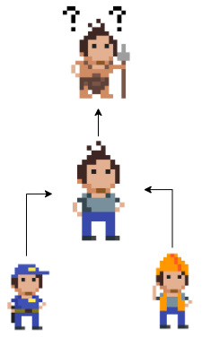

## Het ``base`` keyword
Het **``base``** keyword laat ons toe om bij  ``override`` van een methode of property in de child-klasse toch te verplichten om de parent-implementatie toe te passen. Dit kan handig zijn wanneer je in je child-klasse de bestaande implementatie wenst uit te breiden.

Stel dat we volgende 2 klassen hebben:
```java
class Restaurant
{
     protected int kosten = 0;
     public virtual void PoetsAlles()
     {
           kosten += 1000;
     }
}

class Frituur:Restaurant
{
     public override void PoetsAlles()
     {
           kosten += (1000 + 500);
     }
 
}
```

Het poetsen van een ``Frituur`` is duurder (1000 basis + 500 voor ontsmetting) dan een gewoon ``Restaurant``. Als we echter later beslissen dat de basisprijs (in ``Restaurant``) moet veranderen dan moet je ook in alle child-klassen doen, wat natuurlijk geen goede programmeerstijl is.

``base`` lost dit voor ons. De ``Frituur``-klasse herschrijven we naar:

```java
class Frituur:Restaurant
{
     public override void PoetsAlles()
     {
           base.PoetsAlles(); //eerste basiskost wordt opgeteld
           kosten += 500;  //kosten eigen aan frituur worden bijgeteld.
     }
 
}
```

Het ``base`` keyword laat ons toe om in onze code expliciet een methode of property van de parent-klasse aan te roepen. Ook al overschrijven we de implementatie van ``PoetsAlles`` toch kan de originele versie van de parent-klasse nog steeds gebruikt worden.


We hebben een soortgelijke werking ook reeds gezien bij de constructors van overgeërfde klassen.


Je kan zelf beslissen waar in je code je ``base`` aanroept. Soms doe je dat aan de start van de methode, soms op het einde, soms halverwege. Alles hangt er van af wat je juist nodig hebt.

<!---NOBOOKSTART--->

<!---NOBOOKEND--->
<!---{aside}--->
<!--- {float:right, width:50%} --->

"Ik denk dat ik een extra voorbeeldje nodig ga hebben."

Laten we eens kijken. Beeld je in dat je volgende basisklasse hebt:

```java
class Oermens
{
      public virtual int VoorzieVoedsel()
      {
      
      }
}
```

Wanneer 1 van mijn dorpsgenoten voedsel zoekt (door te jagen) zal hij of zij ergens tussen de 1 en 9 kilogram kunnen verzamelen per keer.

De moderne mens, die overerft van de oermens, is natuurlijk al iets beter in het maken van voedsel en kan dagelijks standaard 100kg voedsel maken. 

Echter, er bestaan ook hipster die houden van de klassieke manier van voedsel verzamelen. Uiteraard hebben zij de technieken van de oermens verbeterd en zullen sowieso toch iets meer voedsel nog kunnen verzamelen met de traditionele methoden:

```java
class ModerneMens: Oermens
{
      private bool IsHipster;

      public override int VoorzieVoedsel()
      {
            if (IsHipster)
                  return base.VoorzieVoedsel() + 20;
            else
                  return 100;
      }
}
```

### Properties overriden
Properties en methoden zijn van hetzelfde pak een laken. Het is dan ook niet meer dan logisch dat ook properties ``virtual`` kunnen zijn.


Stel dat je volgende klasse hebt:

```java
class Auto
{
   virtual public int Fuel { get; set; }
}
```

We maken nu een meer luxueuze auto die een lichtje heeft (als property genaamd ``HeeftVolleTank``) dat aangaat wanneer de benzine-tank vol genoeg is, dit kan via ``override``.


```java
class LuxeAuto : Auto
{
   public bool HeeftVolleTank { get; set; }

   public override int Fuel
   {
      get { return base.Fuel; }
      set
      {
            if (value > 100)
            {
               HeeftVolleTank = true;
            }
            base.Fuel = value;
      }
   }
}
```


Indien je ``override`` intypt in Visual Studio en met autocompletion vervolledig dan zal je zien dat VS zogenaamde Expression Body Member syntax (herkenbaar aan de `` =>``) gebruikt om properties te overriden. Deze syntax behandelen we kort in de appendix van dit boek. 

**Je schrijft dus best manueel de override van properties** indien je niet bekend bent met deze syntax.


<!---{/aside}--->
<!---NOBOOKSTART--->

<!---NOBOOKEND--->
