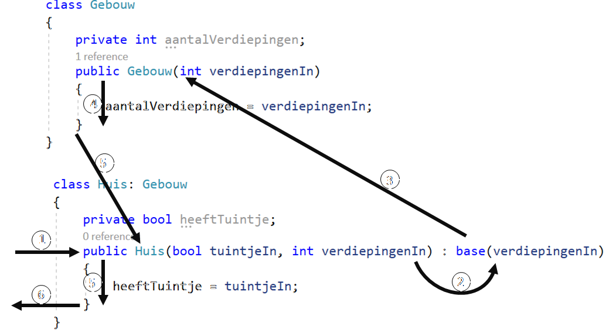

## Constructors bij overerving

Wanneer je een object instantiëert van een child-klasse dan gebeuren er meerdere zaken na elkaar, in volgende volgorde:

* Eerst wordt de constructor aangeroepen van de basis-klasse.
* Gevolgd door de constructors van alle parent-klassen.
* Finaal de constructor van de klasse zelf.

Dit is logisch: de child-klasse heeft de "fundering" nodig van z'n parent-klasse om te kunnen werken.  

Volgende voorbeeld toont dit in actie:

```java
class Soldier
{
   public Soldier() {Console.WriteLine("Soldier reporting in");}
}

class Medic : Soldier
{
   public Medic(){Console.WriteLine("Who needs healing?");}
}
```

Indien je vervolgens een object aanmaakt van het type ``Medic``:

```java
Medic RexGregor = new Medic();
```

Dan zien we de volgorde van constructor-aanroep op het scherm:

<!---{line-numbers:false}--->
```text
Soldier reporting in
Who needs healing?
```

Er wordt dus verondersteld in dit geval dat er een default constructor in de basis-klasse aanwezig is.

### Overloaded constructors en ``base()``

Indien je klasse ``Soldier`` een overloaded constructor heeft, dan wisten we al dat deze niet automatisch een default constructor heeft. Volgende code zou dus een probleem geven indien je een ``Medic`` wilt aanmaken via ``new Medic()``:
```java
class Soldier
{
   public Soldier(bool canShoot) {//...Do stuff  }
}

class Medic:Soldier
{
   public Medic(){Console.WriteLine("Who needs healing?");}
}
```

Wat je namelijk niet ziet bij child-klassen en hun constructors is dat er eigenlijk een impliciete aanroep naar de constructor van de parent-klasse wordt gedaan. Bij alle constructors staat er eigenlijk ``:base()`` achter, wat je ook zelf kunt schrijven:
```java
class Medic:Soldier
{
   public Medic(): base()
   {Console.WriteLine("Who needs healing?");}
}
```

``base()`` achter de constructor zegt  eigenlijk *"roep de default constructor van de parent-klasse aan"*. Je mag hier echter ook parameters meegeven en de compiler zal dan zoeken naar een constructor in de basis-klasse die deze volgorde van parameters kan accepteren.

We zien hier dus hoe we ervoor moeten zorgen dat we terug Medics via ``new Medic()`` kunnen aanroepen zonder dat we de constructor(s) van ``Soldier`` moeten aanpassen:
```java
class Soldier
{
   public Soldier(bool canShoot) {//...Do stuff  }
}

class Medic:Soldier
{
   public Medic():base(true)
    {Console.WriteLine("Who needs healing?");}
}
```

De medics zullen de actuele parameter``canShoot`` dus steeds op ``true`` zetten.

Uiteraard wil je misschien kunnen meegeven bij het aanmaken van een ``Medic`` wat de startwaarde van ``canShoot`` moet zijn. Dit vereist dat je een overloaded constructor in ``Medic`` aanmaakt, die op zijn beurt de overloaded constructor van ``Soldier`` aanroept. 

Je schrijft dan een overloaded constructor in ``Medic`` bij:

```java
class Soldier
{
   public Soldier(bool canShoot) {//...Do stuff  }
}

class Medic:Soldier
{
   public Medic(bool canSh): base(canSh)
   {

   } 

   public Medic():base(true)  //Default
   {
      Console.WriteLine("Who needs healing?");
   }
}
```

Merk op hoe we de formele parameter ``canSh`` doorgeven als actuele parameter aan ``base``-aanroep.

Uiteraard mag je ook de default constructor aanroepen vanuit de child-constructor, alle combinaties zijn mogelijk (zolang de constructor in kwestie maar bestaat in de parent-klasse).

Een hybride aanpak is ook mogelijk. Volgend voorbeeld toont 2 klassen, ``Huis`` en ``Gebouw`` waarbij we de constructor van ``Huis`` zodanig beschrijven dat deze bepaalde parameters "voor zich houdt" en andere als het ware doorsluist naar de aanroep van z'n parent-klasse:

```java
class Gebouw
{
   private int aantalVerdiepingen;
   public Gebouw(int verdiepingenIn)
   {
      aantalVerdiepingen = verdiepingenIn;
   }
}

class Huis: Gebouw
{
   private bool heeftTuintje;
   public Huis(bool tuintjeIn, int verdiepingenIn): base(verdiepingenIn)
   {
      heeftTuintje = tuintjeIn;
   }
}
```
Vanaf nu kan ik een huis als volgt bouwen:
```java
Huis peperKoekenHuis = new Huis(true, 1);
```



De volgorde waarin alles gebeurt in voorgaande voorbeeld is belangrijk om te begrijpen. Er wordt een hele machine in gang gezet wanneer we volgende korte stukje code schrijven:

```java
Huis eenEigenHuis = new Huis(true,5);
```

1. De overloaded constructor van ``Huis`` wordt opgeroepen.
2. Nog voor dat deze echter iets kan doen, wordt de formele parameter ``verdiepingenIn`` (die de waarde ``5`` heeft gekregen) doorgegeven als actuele parameter om de constructor van de basis-klasse aan te roepen.
3. De overloaded constructor van ``Gebouw`` wordt dus aangeroepen.
4. De code van deze constructor wordt uitgevoerd: het aantal verdiepingen van het gebouw/huis wordt ingesteld.
5. Wanneer het einde van de constructor wordt bereikt, zal er teruggegaan worden naar de constructor van ``Huis``.
6. Nu wordt de code van de``Huis`` constructor uitgevoerd: ``heeftTuintje`` krijgt de waarde ``true``.





<!---{/aside}--->
<!---NOBOOKSTART--->

<!---NOBOOKEND--->


<!---NOBOOKSTART--->
# Kennisclip

*[Constructors bij overerving](https://ap.cloud.panopto.eu/Panopto/Pages/Viewer.aspx?id=9d5df664-3e85-4bee-95ef-acb000d34540)
<!---NOBOOKEND--->