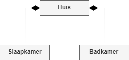
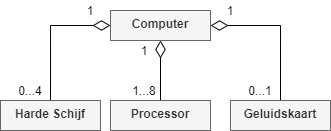
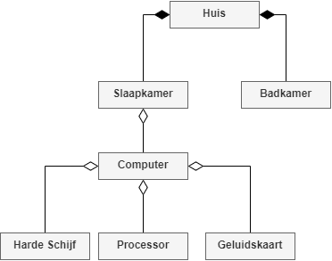
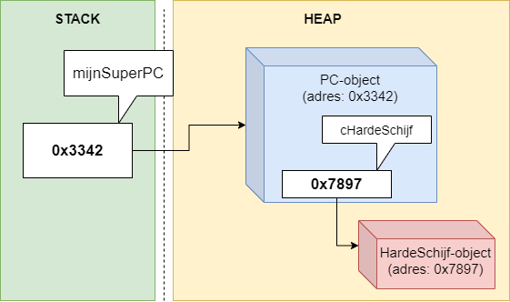

# Compositie en aggregatie 

## Objecten in objecten

Dit hoofdstuk is kort maar krachtig. We gaan niets nieuws uitleggen, maar eerder zaken benoemen die je waarschijnlijk al toepaste zonder te weten dat er daar ook een naam voor was.



We spreken over compositie (**composition**) en aggregatie (**aggregation**) wanneer we een object in een ander object gebruiken. Denk bijvoorbeeld aan een object van het type ``Motor`` dat je gebruikt in een object van het type ``Auto``. Afhankelijk of het 'interne' object kan bestaan zonder het ouder-object bepaalt of het gaat om aggregatie of compositie:

* **Compositie**: Het interne object heeft geen bestaansreden zonder het moederobject. Denk bijvoorbeeld aan een kamer in een huis. Als het huis verdwijnt, verdwijnt ook de kamer.
* **Aggregatie**: Beide objecten kunnen onafhankelijk van elkaar bestaan. Denk hierbij aan de motor in een auto. Wanneer de auto vernietigd wordt kan de motor gered worden en elders gebruikt worden. Een ander voorbeeld zijn de harde schijven in een computer.

Het lijdende voorwerp zal steeds het object zijn dat binnen het onderwerp zal geplaatst worden (*motor* in auto, *schijf* in computer).


### Heeft een-relatie

Overerving konden we detecteren door de "is een"-relatie. Compositie daarentegen detecteren we met behulp van de "heeft een"-relatie tussen 2 klassen. *Een mango heeft een pit. Een vliegtuig heeft een cockpit. Etc.*

Je hoort ook ogenblikkelijk of het om een "heeft één" of "heeft meerdere"-relatie gaat. In het tweede geval, heeft meerdere, wil dit zeggen dat het moederobject **een array van het interne object** in zich heeft. Wederom het voorbeeld van het boek: een boek heeft meerdere pagina's. Dus in de klasse ``Boek`` zullen we vermoedelijk een object van het type ``Pagina[]`` of ``List<Pagina>`` tegenkomen.


Een klassieke fout is overerving gebruiken wanneer je de bijvoorbeeld de relatie tussen een boek en z'n pagina's wilt aanduiden. Een boek is géén pagina, ook niet omgekeerd. Een boek HEEFT een pagina (of meerdere).


#### Compositie en aggregatie beschrijven

Compositie duiden we aan met een lijn die begint met een volle ruit aan de kant van de klasse die de objecten in zich heeft:




Aggregatie duiden we op exact dezelfde manier aan, maar de ruiten zijn niet gevuld. Optioneel duidt een getal aan iedere kant van de lijn de verhouding aan (zowel bij aggregatie als compositie), zodat we kunnen aangeven hoeveel (of geen) objecten het moederobject kan hebben:



Uiteraard zijn ook combinaties mogelijk. Stel je voor dat je een applicatie moet ontwerpen waarin je een reeks huizen moet bouwen, waarbij er in de slaapkamer steeds een computer moet gezet worden:





Herinner je: overerving duiden we aan met een pijl die wijst naar de parent-klasse en duidt een "is een"-relatie aan.



## Compositie en aggregatie in de praktijk

Het verschil tussen aggregatie en compositie is vooral van filosofische aard. In de praktijk zijn er weinig verschillen. 

We bekijken het voorbeeld van de computer en de harde schijf. We hebben twee klassen:
```java
class PC
{
}

class HardeSchijf
{
}
```

Een *PC heeft een HardeSchijf*, dit wil zeggen dat we in de klasse ``PC`` een object (instantievariabele) van het type ``HardeSchijf`` zullen definiëren:

```java
class PC
{
    private HardeSchijf cHardeSchijf;
}
```

In principe kunnen we nu zeggen dat we aggregatie hebben toegepast. Uiteraard moeten we nu deze HardeSchijf nog instantiëren anders zal deze de hele levensduur van ieder PC-object ``null`` zijn. 

De instantie van een geaggregeerd object kan op verschillende manieren en is afhankelijk van wat je nodig hebt in je applicatie.


Compositie is, net zoals overerving, een onderdeel van het OOP paradigma. Er is geen exacte oplossingstrategie om compositie toe te passen: deze zal afhankelijk zijn van je specifieke probleem (en oplossing). Staar je dus niet blind op deze voorbeelden, het is maar een greep uit de vele manieren waarmee je compositie kunt gebruiken.



### Manier 1: Rechtstreeks de instantievariabele instellen

Wanneer we wensen dat iedere nieuwe PC ogenblikkelijk een interne harde schijf heeft dan kunnen we dit doen door ogenblikkelijk de instantievariabele een object te geven: 

```java
class PC
{
    private HardeSchijf cHardeSchijf = new HardeSchijf();
}
```


<!---NOBOOKSTART--->

<!---NOBOOKEND--->
<!---{aside}--->
<!--- {float:right, width:50%} --->

Het moge duidelijk zijn: compositie/aggregatie en referenties horen samen. Maar hoe zit dit er allemaal uit in het geheugen? Blij dat je het vraag! 

Wanneer we van voorgaande klasse een object aanmaken als volgt:

```java
PC mijnSuperPC = new PC();
```

Dan zien we volgende "beeld":



Compositie wil dus niet zeggen dat je in het geheugen grote *monolitische* stukken  gaat hebben die het samengestelde object voorstellen. Neen, we blijven, dankzij de kracht van referenties, de boel apart houden. Zoals je ziet is het belangrijk te beseffen dat bij compositie én aggregatie het *inner* object op zichzelf in de heap ergens zal gezet worden en dus niet *in* het parent-object komt. Alles dat we dus al wisten in verband met het doorgeven van referenties, de GC, etc. blijft dus nog steeds gelden. Of zoals het hoofdstuk al begon: eigenlijk niets nieuws onder de zon! 

<!---{/aside}--->
<!---NOBOOKSTART--->

<!---NOBOOKEND--->


### Manier 2: Via de constructor(s)
Willen we echter bij het aanmaken van een nieuwe pc ook iets meer controle over wat voor harde schijf er wordt geïnstalleerd, dan kan dit ook via de constructors. We zouden dan bijvoorbeeld afhankelijk van bepaalde parameters in de (overloaded) constructors de schijf andere eigenschappen kunnen geven:

```java
class PC
{
    private HardeSchijf cHardeSchijf;    
    
    public PC(bool kortingscode)
    {
        //enkel interne harde schijf indien klant kortingscode gebruikte
        if(kortingscode) 
            cHardeSchijf = new HardeSchijf();
        else 
            cHardeSchijf == null; 
    } 
}
```
<!---NOBOOKSTART--->

<!---NOBOOKEND--->
<!---{aside}--->
<!--- {float:right, width:50%} --->


De lijn ``cHardeSchijf == null`` is niet noodzakelijk, daar ``cHardeSchijf`` sowieso ``null`` zal zijn indien we niet in de ``if`` gaan. Het kan echter geen kwaad dit expliciet te doen. Hiermee zeg je nadrukkelijk: "als we via de overloaded constructor een PC aanmaken en er is geen kortingscode gebruikt dan zit er geen harde schijf in de pc". Het kan namelijk gebeuren dat voor we aan deze code er ondertussen iets voor heeft gezorgd dat ``cHardeSchijf`` alsnog een object. Door deze nu op ``null`` te zetten verwijderen we zeker de harde schijf als die er toch nog had ingezeten.

Heb je gezien hoe ik praat over deze code alsof het om iets gaat dat in het echte leven gebeurt? Dit is bewust: het OOP paradigma draait om het feit dat het ons toelaat de realiteit zo dicht mogelijk te benaderen. Het helpt dan ook om je code (en probleemanalyse) steeds vanuit de context van de "echte wereld" te benaderen. Bijna ieder concept uit de echte wereld heeft een equivalent binnen C# als OOP-taal.

Het is een goede OOP oefening om af en toe in je omgeving eens rond te kijken, en wat je ziet vervolgens te vertalen naar een structuur van klassen, objecten en verbanden tussen die dingen (overerving, compositie, arrays en later ook nog polymorfisme en interfaces).
<!---{/aside}--->
<!---NOBOOKSTART--->

<!---NOBOOKEND--->

<!---{pagebreak} --->


### Manier 3: Properties
De vorige 2 voorbeelden waren eigenlijk voorbeelden van *compositie*. Wanneer de PC-objecten vernietigd worden (door de GC) zullen ook de interne harde schijven verdwijnen. 

Willen we echter via *aggregatie* de pc's bouwen, dan is het logischer dat we op een andere, externe plaats de ``HardeSchijf`` objecten aanmaken en deze vervolgens, nadat de PC werd aangemaakt, in de PC plaatsen. We gebruiken hierbij Properties om toegang tot het interne (geaggregeerde) object te verschaffen:

```java
class PC
{
    public HardeSchijf CHardeSchijf
    {
      get
      {
        return cHardeSchijf;
      }
      set
      {
        cHardeSchijf = value;
      }
    }
    private HardeSchijf cHardeSchijf;
}

```

Vervolgens kunnen we nu van buitenuit het object benaderen en er , als het ware, een nieuwe harde schijf in steken. 
```java
HardeSchijf myHardeSchijf = new HardeSchijf();
myPC.CHardeSchijf = myHardeSchijf;
```

Op deze manier hebben we nog steeds een referentie naar ``myHardeSchijf`` en zal de GC dit object dus niet verwijderen wanneer , om welke reden ook, ``myPC`` wordt opgekuist.



Kortom, nog steeds niets nieuws onder de zon. Alle manieren die ja al kende om met bestaande types objecten aan te maken gelden nog steeds. Compositie deed je al de hele tijd wanneer je bijvoorbeeld zei "een student heeft een leeftijd" en dan een instantievariabele ``int age`` aanmaakte. Het grote verschil is echter dat objecten moeten geïnstantieerd worden, wat niet moest met value-types en je dus iets vaker op ``null`` zal moeten controleren.



### Compositie en aggregatie objecten gebruiken

Stel je voor dat de klasse ``HardeSchijf`` ook een autoproperty ``MaxCapacity`` heeft. De klasse ``PC`` kan dankzij compositie dus nu ook die property gebruiken, zoals volgende voorbeeld toont:

```java
class PC
{
    private HardeSchijf cHardeSchijf = new HardeSchijf();

    public void ToonComputerInfo()
    {
        Console.WriteLine("Dit is een Intel i9");
        Console.WriteLine($"Capaciteit HD: {cHardeSchijf.MaxCapacity} Gb");
    }
}
```



### NullReferenceException is een klassieke fout

Een veelvoorkomende fout bij compositie en aggregatie van objecten is dat je een intern object aanspreekt dat nooit werd geïnstantieerd. Je krijgt dan een ``NullReferenceException``.

Het is dus zeker bij compositie en aggregatie een goede gewoonte om zoveel mogelijk te controleren op ``null`` telkens je het object gaat gebruiken:

```java
public void ToonComputerInfo()
{
    Console.WriteLine("Dit is een Intel i9");
    if(cHardeSchijf != null)
         Console.WriteLine($"Capaciteit HD: {cHardeSchijf.MaxCapacity} Gb");
    else
        Console.WriteLine("Er is geen harde schijf aanwezig");
}
```

En uiteraard kan het ook nooit kwaad om alles in ``try-catch`` blokken te zetten, alleen is dat op detail-niveau niet werkbaar: je werkt met objecten en zal dus bijna de hele tijd code hebben waar ``NullReferenceException`` een potentieel gevaar is. Het is dus beter om vanaf de start je code zodanig te schrijven (met controles op ``null``) dat er quasi geen uitzonderingen op ``null`` kunnen optreden.



## "Heeft meerdere"- relatie

Wanneer een object meerdere objecten van een specifiek type heeft (denk maar aan "een boek heeft meerdere pagina's" of "een boom heeft bladeren") dan zullen we een array of een list als compositie-object gebruiken. 

Voorbeeld:

```java
class Page{}

class Boek
{
   private Page[] allPages = new Page[100];
}
```

Indien je nu een pagina wenst toe te voegen dan moet je ook deze individuele array-elementen nog instantieren.

```java
class Book
{
   public void InsertPage(Page toAdd, int position)
   {
       allPages[position] = toAdd;
   }

   private Page[] allPages = new Page[100];
}
```
 Een voorbeeld waarbij men vervolgens van buitenuit het object bestaande pagina's kan toevoegen:

```java
Book myBook = new Book();
Page myThirdPage = new Page();
myBook.InsertPage(myThirdPage, 2);
```

Of een voorbeeld met ``List``:

```java
class Book
{
    public List<Page> AllPages{get;set;} = new List<Page>();
}

```
Dit heeft als voordeel dat we de ``Insert`` methode van de ``List``-klasse kunnen gebruiken en niet zelf nog moeten schrijven:
```java
myBook.AllPages.Insert(new Page(), 5); 
```


Dit voorbeeld met ``List`` is vanuit OOP-standpunt niet ideaal. Het vereist namelijk dat programmeurs die jouw klasse ``Book`` gebruiken, weten dat intern met een ``List`` wordt gewerkt. Met andere woorden. We willen echter zo goed mogelijk een **blackbox** creëren die van buitenuit duidelijk en eenvoudig in gebruik is. Het is daarom beter om alsnog aan je ``Book`` klasse een ``Insert`` methode toe te voegen. Dit geeft als extra verbetering dat we daarmee onze lijst van pagina's ``private`` kunnen houden:

```java
class Book
{
    private List<Page> allPages = new List<Page>();
    
    public void InsertPage(Page toAdd, int position)
    {
        allPages.Insert(toAdd, position)
    }
}
```

Pagina's voegen we nu als volgt toe:

```java
myBook.InsertPage(new Page(), 5); 
```



<!---NOBOOKSTART--->

<!---NOBOOKEND--->
<!---{aside}--->
<!--- {float:right, width:50%} --->


<!---{/aside}--->
<!---NOBOOKSTART--->

<!---NOBOOKEND--->


## Compositie of overerving

We vertelden in het begin van dit hoofdstuk dat compositie en aggregatie een "heeft een"-relatie aanduiden, terwijl overerving een "is een"-relatie behelst.  In de praktijk zal je véél vaker compositie en aggregatie moeten gebruiken dan overerving. 
Compositie en aggregatie laat ons toe om 2 (of meer) totaal verschillende soorten zaken met elkaar te laten samenwerken, iets wat met oververing enkel kan indien beide zaken een "is een"-relatie hebben. Dit zien we ook in de echte wereld: de zaken rondom ons zullen vaker een compositie/aggregatie-relatie hebben dan een overervings-relatie.

Zoals je hopelijk beseft kan dus alles een compositieobject zijn in een ander object.  Denk maar aan een ``Dictionary`` van klanten die je gebruikt in een klasse ``Winkel``. Of wat te denken van de klasse ``Mens`` die uit een hele boel organen bestaat. Ieder orgaan is compositie-object in de klasse ``Mens``, zoals 2 ``Nier``-objecten, een ``Hersenen`` instantie, 1 ``Hart`` instantie etc. Iemand die in jouw Mens-simulator een nieuw hart nodig heeft kan dat dan dankzij *manier 3* , via een property ingeplant krijgen (excuses voor het wat lugubere voorbeeld):

```java
Mens patient = new Mens();
Mens donor = new Mens();

//Donor heeft een tragisch ongeluk en sterft
//Operatie start
patient.Hart = null; //vorig hart wordt "verwijderd"
patient.Hart = donor.Hart; 

donor = null //donor wordt begraven
```


Let er wel op dat je niet overal compositie begin toe te passen alsof je de Dokter Frankenstein van C# bent. Hoe meer compositie (of aggregatie) je toepast in een klasse, hoe specifieker die soms wordt, en daardoor mogelijk minder herbruikbaar. Het is om die reden dat we verderop interfaces gaan ontdekken om ervoor te zorgen dat 2 of meerdere klassen minder "op/in elkaar gelijmd" zitten ten gevolge van bijvoorbeeld een nogal hechte compositie.
