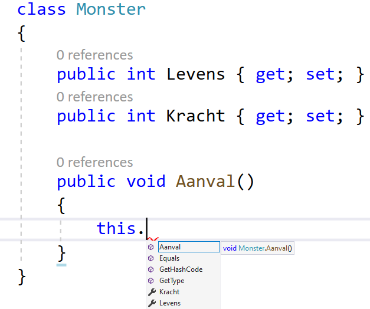
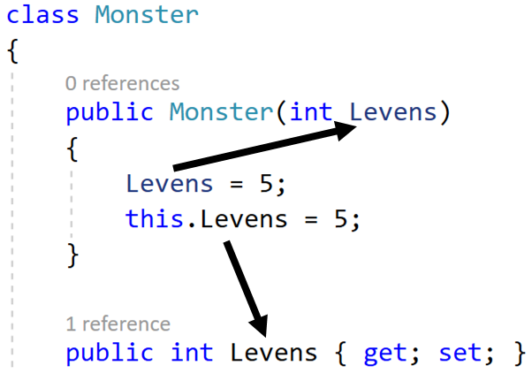

## Het this keyword

Je zult in je zoektocht naar online antwoorden mogelijk al een paar keer het ``this`` keyword zijn tegengekomen. Dit keyword kan je aanroepen in een object om de referentie van het object terug te krijgen. Met andere woorden: het laat toe dat een object "zichzelf" kan aanroepen. Dat klinkt vreemd, maar heeft 2 duidelijke gebruiken:
* Het laat toe dat een object zichzelf kan meegeven als actuele parameter aan een methode
* Het laat toe instantievariabelen en properties aan te roepen van het object die mogelijk dezelfde naam hebben als een lokale variabele


### Aanroepen van instantievariabelen met zelfde naam

Wanneer je ``this`` gebruikt binnen een klasse, dan zal je zien dat bij het schrijven van de dot-operator je ogenblikkelijk de volledige interne structuur van de klasse kunt bereiken:



Enerzijds ben je vrij om altijd ``this`` te gebruiken wanneer je eender wat van de klasse zelf wilt bereiken. Vooral in oudere code-voorbeelden zal je dat nog vaak zien gebeuren.

Anderzijds laat ``this`` ook toe om properties, methoden en instantievariabelen aan te roepen wanneer die mogelijk op de huidige plek niet aanroepbaar zijn omdat hun naam conflicteerd met een lokale element. Volgende voorbeeld toont waarom dit belangrijk kan zijn:



De lijn ``Levens = 5;`` in de constructor zal de parameter zelf van waarde aanpassen (wat niet bepaald aan te raden valt). Terwijl door ``this`` te gebruiken geraak je aan de property met dezelfde naam.

### Object geeft zichzelf mee als parameter

Beeld je in dat je volgende ``Management`` klasse hebt die toe laat om ``WerkNemer`` objecten te promoveren:
```java
class Management
{
    public static void PromoveerWerknemer( Werknemer toPromote)
    {
        if(MagPromoveren(toPromote)
        {
            toPromote.VerhoogSalaris(1000);
            toPromote.Rang++;
        }
    }
}
```

Dankzij het ``this`` keyword kan je nu vanuit de klasse ``WerkNemer`` deze externe methode aanroepen:

```java
class Werknemer
{
    public void VraagPromotie()
    {
        Management.PromoveerWerknemer(this);
    }
}
```

Op deze manier geeft het object waarop je ``VraagPromotie`` op aanroept zichzelf mee als actuele parameter aan ``Management.PromoveerWerknemer()``.