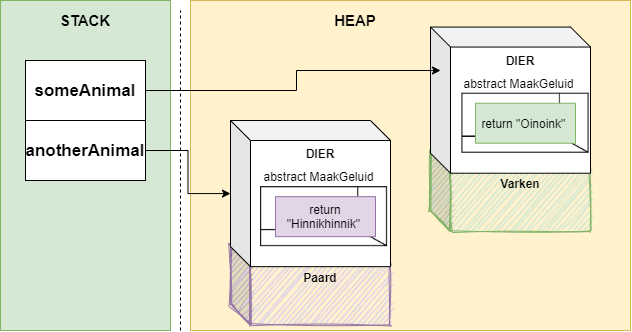

# Polymorfisme

**Polymorfisme** (*polymorphism*) is het finale puzzelstukje in dit boek.  Naast het blackbox of encapsulatie principe en overerving, is polymorfisme de derde grote peiler van object georiënteerd programmeren. 


De latijnse naam polymorfisme bestaat uit 2 delen: *poly* en *morfisme*, letterlijk dus "meerdere vormen". En geloof het of niet, deze naam dekt de lading ongelooflijk goed. 

Polymorfisme laat ons toe dat objecten kunnen behandeld worden als objecten van de klasse waar ze van overerving. Dit klinkt logisch, maar zoals je zo meteen zal zien zal je hierdoor erg krachtige code kunnen schrijven. Anderzijds zorgt polymorfisme er ook voor dat het ``virtual`` en ``override`` concept bij methoden en properties ook effectief werkt. Het is echter vooral de eerste eigenschap waar we in dit hoofdstuk dieper op in zullen gaan.


## De "is een"-relatie in actie

Dankzij overerving kunnen we "is een"-relaties beschrijven. Soms is het echter handig dat we al child-objecten als één geheel zouden kunnen beschouwen. Beeld je in dat je een gigantische klasse-hiërarchie hebt gemaakt, maar finaal wil je wel dat bijvoorbeeld alle objecten een bepaalde property aanpassen die ze gemeenschappelijk hebben. Zonder polymorfisme is dat een probleem.

Stel dat we een een aantal Dier-gerelateerde klassen hebben die allemaal op hun eigen manier een geluid voortbrengen:
```java
abstract class  Dier
{
   public abstract string MaakGeluid();
}
```
Twee child-klassen:
```java
class Paard: Dier
{
  public override string MaakGeluid()
  { 
      return "Hinnikhinnik";
  }
}

class Varken: Dier
{
  public override string MaakGeluid()
  { 
      return "Oinkoink";
  }
}
```

Dankzij polymorfisme kunnen we nu elders objecten van Paard en Varken in een ``Dier`` bewaren, maar toch hun eigen geluid laten reproduceren:
```java
Dier someAnimal = new Varken();
Dier anotherAnimal = new Paard();
Console.WriteLine(someAnimal.MaakGeluid()); //Oinkoink
Console.WriteLine(anotherAnimal.MaakGeluid()); //Hinnikhinnik
```

Alhoewel er een volledig ``Varken`` en ``Paard`` object in de heap wordt aangemaakt (en blijft bestaan), zullen variabelen van het type ``Dier`` enkel die dingen kunnen aanroepen die in de klasse ``Dier`` gekent zijn. Dankzij ``override`` zorgen we er echter voor dat ``MaakGeluid`` wel die code uitvoert die specifiek bij het child-type hoort:





Het is belangrijk te beseffen dat  ``someAnimal`` en ``anotherAnimal`` van het type ``Dier`` zijn en dus enkel die dingen kunnen die in ``Dier`` beschreven staan. Enkel zaken die ``override`` zijn in de child-klasse zullen met de specialisatie-code werken.




## Objecten en polymorfisme

Kortom, polymorfisme laat ons toe om referenties naar objecten van een child-type, toe te wijzen aan een variabele van het parent-type.

Dit wil dus ook zeggen dat dit mag (daar alles overerft van ``System.Object``):

```java
System.Object mijnObject = new Varken();
```

Alhoewel dus ``mijnObject`` effectief een ``Varken`` is, kunnen we enkel aan dat gedeelte dat in de klasse ``System.Object`` staat beschreven, zijnde de klassieke 4 methoden (``ToString``, ``Equals`` etc.). Als we het varken toch geluid willen laten maken, dan zal dat niet werken!



## Arrays en polymorfisme

Arrays en lijsten laten heel krachtige code toe dankzij polymorfisme. Je kan een lijst van de basis-klasse maken en deze vullen met allerlei objecten van de basis-klasse **én de child-klassen**. 

Een voorbeeld:

```java
List<Dier> zoo = new List<Dier>();
zoo.Add(new Varken());
zoo.Add(new Paard());
foreach(var dier in zoo)
{
  Console.WriteLine(dier.MaakGeluid());
}
```

We hebben dus nu een manier gevonden om onze objecten op de juiste momenten even als één geheel te gebruiken, zonder dat we verplicht zijn dat ze allemaal van hetzelfde type zijn!

<!---NOBOOKSTART--->

<!---NOBOOKEND--->
<!---{aside}--->
<!--- {float:right, width:50%} --->


Polymorfisme is een heel krachtig concept. Door een referentie naar objecten te bewaren in een variabele van hun basistype en , wanneer nodig, ze als 'zichzelf' te gebruiken wordt je code een pak eenvoudiger.
Vaak weet je niet op voorhand wat voor elementen je in je lijst wilt plaatsen. Via polymorfisme lossen we dit op. Stel bijvoorbeeld dat je een lijst van Personen hebt (``List<Person>``) waar echter elementen van subklassen in terecht kunnen komen (``Bakker``, ``Student``, etc) , dan laat polymorfisme dit gewoon toe om ook deze elementen in die lijst te plaatsen.

<!---{/aside}--->
<!---NOBOOKSTART--->

<!---NOBOOKEND--->

<!---NOBOOKSTART--->
# Kennisclip


* [Polymorfisme](https://ap.cloud.panopto.eu/Panopto/Pages/Viewer.aspx?id=6bc13cf3-83d0-449d-9d8f-ab7d00c5a021)

* [Polymorfisme in praktijk "demo met kaartspel dee2"](https://ap.cloud.panopto.eu/Panopto/Pages/Viewer.aspx?id=a1009330-272d-4978-a078-aba2012ab2b8)
<!---NOBOOKEND--->