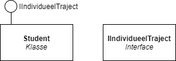
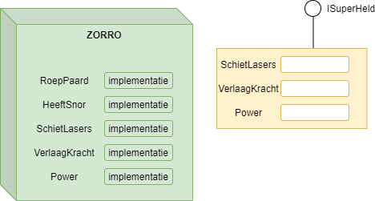
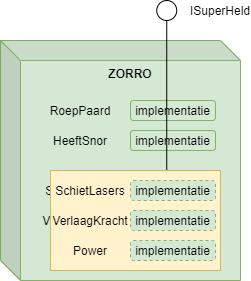
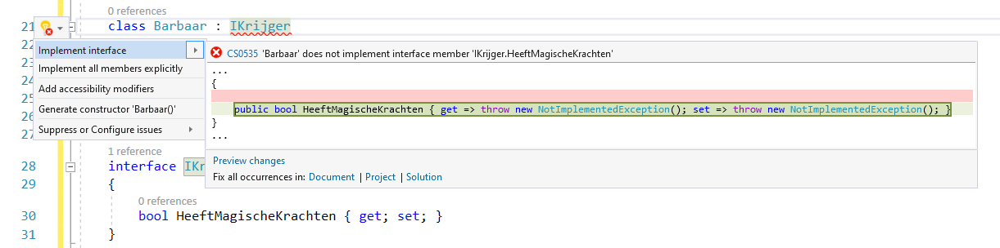

# Interfaces

**Interfaces in de echte wereld**

De naam interface kan je letterlijk vertalen als "tussen vlakken". Een interface is de verbinding tussen 2 systemen, van welke vorm ook. In de echte wereld gebruik je constant interfaces. Telkens je met de auto rijdt gebruik je een interface: namelijk een handvol handelingen om de auto te laten rijden (pedalen, stuur, etc.). Bijna alle auto's hanteren deze zelfde interface. Van zodra je de interface kent en begrijpt kan je die overal gebruiken, zonder dat je moet weten wat er in het systeem intern juist gebeurt (als ik de gaspedaal induw boeit het niet of ik op gas of elektrisch rijd, zolang de auto maar voortbeweegt). 

Aan de achterkant van je computer (en ook in de pc zelf) zijn tal van hardware-interfaces. Afgesproken manieren om 2 systemen met elkaar te laten communiceren. Zo heb je de USB-aansluiting die toelaat dat een extern systeem met een usb-aansluiting met de computer kan communiceren. Maar ook de HDMI, audio, en andere aansluitingen hanteren interfaces. Zouden er rond deze zaken geen wereldwijde interfaces zijn afgesproken, dan zou je mogelijk telkens op een andere manier je externe harde schijf aan een computer moeten hangen.


Voor je dolenthousiast wordt, denkende dat je eindelijke grafische applicaties (GUI oftewel Graphical User Interface ) gaat maken, moet ik je helaas teleurstellen. Dit hoofdstuk behandelt het programmeer-concept *interfaces* wat eigenlijk niets te maken heeft met User interfaces. U weze gewaarschuwd.



**Interfaces in OOP**

Dit concept van interfaces uit de echte wereld heeft dus ook een OOP variant. Namelijk de interface tussen 2 (of meer) klassen. Door te beloven dat een klasse aan een bepaalde interface voldoet kunnen alle klassen die deze interface "kennen" met elkaar praten. **Een interface in OOP is een beschrijving van publieke methoden en properties die de klasse belooft te hebben.** Net zoals je een fotocamera kunt kopen die de HDMI en USB-interface heeft, zo ook kan je nu een klasse maken die zegt interface , bijvoorbeeld de interfaces ``ISecure`` en ``IStreamable`` te hebben.


Interfaces zijn als het ware stempels die we op een klasse kunnen plakken om zo te zeggen "deze klasse gebruikt interface xyz". Gebruikers van de klasse hoeven dan niet de hele klasse uit te spitten en weten dat alle klassen met interface xyz dezelfde publieke properties en methoden hebben. 



Een interface is niet meer dan een belofte: het zegt enkel welke publieke methoden en properties de klassen bezit. Het zegt echter niets over de effectieve code/implementatie van deze methoden en properties.


### Interfaces in C#

Een interface is dus eigenlijk als het ware een klein stukje papier waar je op zet "om aan deze interface te voldoen moet je zeker volgende methoden en properties hebben". Kortom, is een interface-bestand niet heel veel. Het is letterlijk de "Dit apparaat is USB 3.0 compatibel"-sticker.


Volgende code toont hoe we een interface definiëren in C#. Volgende interface kunnen we gebruiken in een spel waarin sommige van de klassen ook aan de Superhelden-interface voldoen:

```java
interface ISuperHeld
{
    void SchietLasers();
    int VerlaagKracht(bool isZwak);
    int Power{get;set;}
}
```
Enkele opmerkingen hierbij zijn op z'n plaats:

* Het woord ``class`` wordt niet gebruikt, in de plaats daarvan gebruiken we ``interface``.
* Het is een goede gewoonte om interfaces met een I te laten starten in hun naamgeving.
* Methoden en properties gaan niet vooraf van ``public``: interfaces zijn van nature al publiek, dus alle methoden en properties van de interface zijn dat bijgevolg ook (uiteraard geldt dit niet voor andere methoden in de klassen, deze mogen nog steeds ``private`` zijn als dat nodig is).
* Er wordt geen code/implementatie gegeven: iedere methode eindigt ogenblikkelijk met een puntkomma.


Het is in de klassen dat we nu vervolgens verplicht zijn deze methode en properties te implementeren.


Ook abstracte klassen kunnen één of meerdere interfaces hebben. In het geval van een abstracte klasse is deze niet verplicht de interface ook al te implementeren, en mag (delen van) de interface ook als abstract aangeduid worden.



Een interface is een beschrijving hoe een component een andere component kan gebruiken, zonder te zeggen hoe dit moet gebeuren. De interface is met andere woorden 100% scheiding tussen de methode/Property-signatuur en de eigenlijke implementatie ervan.



#### Interface regels

Interfaces zijn als het ware standaarden waaraan een klasse moet voldoen, wil het kunnen zeggen dat het een bepaalde interface heeft. Standaarden impliceert dat er duidelijke afspraken nodig zijn. Bij C# interfaces zijn er enkele belangrijke regels:
* Je kan geen  instantievariabelen declareren in een interface (dat hoort bij de implementatie).
* Je kan geen constructors declareren.
* Je kan geen access modifiers specificeren (``public``, ``protected``, etc): alles is ``public``.
* Je kan nieuwe types (bv ``enum``) in een interface declareren.
* Een interface kan niet overerven van een klasse, wel van één of meerdere  interfaces.


## Interfaces en klassen

We kunnen nu aan klassen de stempel ``ISuperHeld`` geven zodat programmeurs weten dat die klasse gegarandeerd de methoden ``SchietLasers``, ``VerlaagKracht`` en de property ``Power`` zal hebben.

Volgende code toont dit:
```java
class Zorro: ISuperHeld
{
    public void RoepPaard(){...}
    public bool HeeftSnor{get;set;}
    public void SchietLasers() //interface ISuperHeld
    {
        Console.WriteLine("pewpew");
    }
    public int VerlaagKracht(bool isZwak)//interface ISuperHeld
    {
        if(isZwak) 
            return 5;
        return 10;
    }
    public int Power {get;set;} //interface ISuperHeld
}
```
Zolang de klasse ``Zorro`` niet exact de interface inhoud implementeert zal deze klasse niet gecompileerd kunnen worden.



Een "lolly" op een klasse geeft aan dat deze klasse een bepaalde interface heeft in UML notatie. In volgende tekening hebben we een klasse ``Student`` en een interface ``IIndividueelTraject``. We gebruiken de UML notatie voor een interface om aan te geven dat de ``Student`` klasse de ``IIndividueelTraject`` heeft:




<!---{pagebreak} --->

Een visuele manier om interfaces voor te stellen is de volgende. Eigenlijk is een interface als het ware een blad papier dat je bovenop je klasse kunt houden. Op het blad staan de methoden en properties beschreven die de interface moet hebben. Als je het blad mooi bovenop een klasse plaatst die de interface belooft te doen, dan zouden de gaten in het blad mooi bovenop de respectievelijke methoden en properties van de klasse passen.

<!--- {width:60%} --->


<!--- {width:60%} --->


<!---{pagebreak} --->


<!---NOBOOKSTART--->

<!---NOBOOKEND--->
<!---{aside}--->
<!--- {float:right, width:50%} --->

Je zei net: *"Volgende interface kunnen we gebruiken in een spel waarin sommige klassen superhelden zijn."* Die zin impliceert toch overerving "sommige klassen **zijn** superhelden"? 

Dat klopt, maar zoals we weten kan je maar van 1 klasse overerven. Beeld je in dat je een uitgebreide klasse-hiërarchie hebt gemaakt bestaande uit monsters, mensen, huizen en voertuigen. Deze 4 groepen hebben mogelijk geen gemeenschappelijke parent, maar toch willen we dat sommige monster-klasse superhelden kunnen worden, net zoals sommige mensen EN zelfs enkele voertuigen (Transformers!). 

Dankzij interface kunnen we als het ware een stukje de beperking dat je maar van 1 klasse kunt overerven opvangen. Sommige klassen ZIJN een voertuig MAAR OOK een Superheld. Met andere woorden, klassen kunnen meerdere interfaces implementeren.

Merk wel op dat de interface NIET de implementatie bevat van wat een superheld juist doet. Het gaat enkel beloven dat de klasse bepaalde methoden en properties heeft.

<!---{/aside}--->
<!---NOBOOKSTART--->

<!---NOBOOKEND--->


Wanneer je in VS een klasse schrijft die een bepaalde interface moet hebben, dan kan je die snel implementeren. Je schrijft de klasse-signatuur en klikt er dan op: links verschijnt het *lampje* waar je vervolgens op kunt klikken en kiezen voor "Implement interface". En presto!


Merk op dat VS de nieuwere EDM syntax hier hanteert bij properties. Meer informatie hierover vind je in de appendix.



## Het ``is`` keyword met interfaces

We kunnen ``is`` gebruiken om te weten of een klasse een specifieke interface heeft. Dit laat ons toe om code te schrijven die weer een beetje meer polyvalent wordt. 

Stel dat we volgende klassen hebben waarbij de ``Book`` klasse de ``IDeletable`` interface implementeert:

<!---{line-numbers:false}--->
```java
interface IDeletable{ ... };
class Book: IDeletable { ... };
class Person { ... };
```

We kunnen nu met ``is`` objecten bevragen of ze de interface in kwestie hebben:
```java
Person tim = new Person();
Book gameOfThrones = new Book();

if(gameOfThrones is IDeletable)
{
    Console.WriteLine("I can delete game of thrones");
}
if(tim is IDeletable)
{
    Console.WriteLine("I can delete tim");
}
```

De output zal worden: ``I can delete game of thrones``.

Net zoals bij onze voorbeelden over polymorfisme en ``is`` zal de kracht van interfaces pas zichtbaar worden wanneer we met arrays of lijsten van objecten werken. Indien deze lijst een bont allegaartje objecten bevat, allemaal met specifieke parents én interfaces, dan kunnen we weer met ``is`` bijvoorbeeld alle objecten benaderen die een bepaalde interface hebben:

```java
foreach(var persoon in WerkNemers)
{
    if(persoon is IManager)
    {
        //...
    }
}
```

<!---{pagebreak} --->

### Meerder interfaces
Een nadeel van overerving is dat een klasse maar van 1 klasse kan overerven. Een klasse mag echter wel meerdere interfaces met zich meedragen:
```java
interface ISuperHeld{...}
interface ICoureur{...} 
class Man {...}

class Zorro:Man, ISuperHeld
{...}

class Batman:Man, ISuperHeld, ICoureur 
{...}
```


Merk op dat de volgorde belangrijk is: eerst plaats je de klasse waarvan wordt overgeërfd, dan pas de interface(s).


Ook mogen interfaces van elkaar overerven:
```java
interface IGod:ISuperHeld
{...}
```


<!---NOBOOKSTART--->

<!---NOBOOKEND--->
<!---{aside}--->
<!--- {float:right, width:50%} --->


In kleine projecten lijken interfaces wat overkill, en dat zijn ze vaak wel. Van zodra je een iets complexer project krijgt met meerdere klasse die onderling met elkaar allerlei zaken moeten doen, dan zijn interfaces je dikke vrienden!
Je hebt misschien al over de *SOLID programmeerprincipes* gehoord? 

And if not, niet erg. Samengevat zegt SOLID dat we een bepaalde hoeveelheid abstractie inbouwen enerzijds (zodat we niet de gore details van klassen moeten kennen om er mee te programmeren) anderzijds dat er een zogenaamde 'separation of concerns' (SoC) moet zijn (ieder deel/klasse/module van je code heeft een specifieke opdracht). 

Met interfaces kunnen we volgens de SOLID principes programmeren: het boeit ons niet meer wat er in de klasse zit, we kunnen gewoon aan de interfaces van een klasse zien wat hij kan doen. Handig toch! 

<!---{/aside}--->
<!---NOBOOKSTART--->

<!---NOBOOKEND--->

## Polymorfisme en interfaces

Een object aanmaken van een interface is natuurlijk onmogelijk. Je object zou flinterdun zijn zonder inhoud. Maar, dankzij polymorfisme kunnen we wel variabelen aanmaken van een interfacetype die een referentie hebben naar een object dat die interface heeft:

<!---{line-numbers:false}--->
```java
IManager deBaas = new Werknemer();
```

Op dat moment kunnen we via ``deBaas`` aan het gedeelte van het ``Werknemer`` object dat in de ``IManager`` interface beschreven staat. Krachtig toch! 

### Interfaces en polymorfisme in de praktijk

Beeld je in dat je een complexe klasse ``DiskWriter`` hebt die je programma gebruikt om data van en naar de harde schijf te schrijven. De klasse implementeert een interface ``IData`` die twee methoden heeft (``ReadData()`` en ``WriteData``).

Als je later beslist om je data naar een online server te schrijven en niet naar de harde schijf, dan kan je gewoon die klasse schrijven (bv. ``InternetWriter``) en vervolgens ook de ``IData`` interface laten implementeren. Al je andere code moet dan niet aangepast worden! Ze (je andere klassen) kunnen gewoon blijven zeggen ``ReadData`` en ``WriteData`` en weten misschien zelfs niet dat hun  data niet meer naar de HD maar naar het internet wordt gestuurd.
Mooi toch!

Volgende code toont dit.Dit is de interface die we gaan beschrijven:

```java
interface IData
{
    void ReadData();
    void WriteData();
}
```

Vervolgens maken we enkele writers die deze interface gebruiken:

```java
class DiskWriter : IData
{
    public void ReadData()
    {
        //Lees van harde schijf
    }

    public void WriteData()
    {
        //Schrijf naar harde schijf
    }
    //Allerlei andere zaken
}
```

```java
class InternetWriter: IData
{
    public void ReadData()
    {
        //Lees van internet
    }

    public void WriteData()
    {
        //Schrijf naar internet
    }
}
```

Nu maken we een klasse die effectief die writer gebruikt. De truc zit hem er in dat deze klasse met ``IData`` werkt via compositie en dus niet weet naar waar alles zal geschreven worden. Beter zelfs: de klasse weet het niet, en hoeft dat ook niet te weten. Je kan vervolgens volgens de compositie regels instellen welk object ``IData`` krijgt. In volgend voorbeeld stellen we dit in via de constructor, maar je zou ook van ``datadoel`` een property kunnen maken:

```java
class Logbook
{
    private IData datadoel;
    public Logbook(IData doel)
    { 
        datadoel = doel; 
    }
    public void Schrijf()
    {
        datadoel.WriteData();
    }
    //etc.
}
```

Vanaf nu kan je ``Logbook``-objecten aanmaken die naar verschillende plekken schrijven/lezen zonder dat je IN  ``logbook`` moet weten naar waar dat gebeurt:

```java
Logbook naarlokalefile = new Logbook(new DiskWriter());
naarlokalefile.Schrijf();
Logbook naarInternet = new Logbook(new InternetWriter());
naarInternet.Schrijf();
```


Voor de geïnteresseerden, dit concept is een eerste stap naar *Dependency Injection*, een erg krachtig concept dat je nog veel zal tegenkomen in je verdere programmeercarrière, maar wat we niet in dit boek gaan behandelen.



<!---NOBOOKSTART--->
# Kennisclip


* [Interfaces](https://ap.cloud.panopto.eu/Panopto/Pages/Viewer.aspx?id=45c9a641-7333-432b-8f67-acb00082080f)
<!---NOBOOKEND--->
