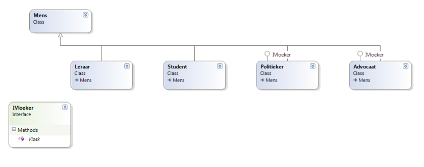

## Alles samen : Polymorfisme, interfaces en is/as

<!---NOBOOKSTART--->

Bekijk zeker de "Fuifsimulator" onderaan bij de videoclips. Deze wordt niet in de tekst besproken maar heeft wel een erg goed inzicht in deze materie.

<!---NOBOOKEND--->

De eigenschappen van polymorfisme en interfaces combineren kan zeer krachtige tot zeer krachtige code resulteren wanneer we dan ook nog eens de``is`` en ``as`` keywords gebruiken zoals we ook al even toonden in de vorige sectie. Als afsluiter van deze lange reis in OOP-land zullen we daarom een voorbeeld tonen waarin de verschillende OOP-concepten samenkomen om, je raadt het nooit, vloekende mensen op het scherm te tonen.


### Vloekende mensen: Opstart

De idee is de volgende: mensen kunnen spreken. Leraren, Studenten, Politieker, en ja zelfs Advocaten zijn mensen. Echter, enkel Politiekers en Advocaten hebben ook de interface ``IVloeker`` die hen toelaat eens goed te vloeken.  Brave leerkrachten en studenten doen dat niet (kuch). We willen een programma dat lijsten van mensen bevat waarbij we de vloekers kunnen doen vloeken zonder complexe code te moeten schrijven.

We hebben volgende klasse-structuur:




Als basis klasse ``Mens``  hebben we:

```java
public class Mens
{
    public void Spreek()
    {
        Console.WriteLine("Hoi!");
    }
}
```
Voorts definiëren we de interface ``IVloeker``  als volgt:

```java
interface IVloeker
{
    void Vloek();
}
```

We kunnen nu de nodige child-klassen maken.
1. De niet-vloekers: ``Leraar`` en ``Student``
2. De vloekers: ``Advocaat`` en ``Politieker``

```java
class Leraar:Mens {} //moet niets speciaal doen

class Student:Mens{} //ook studenten doen niets speciaal

class Politieker: Mens, IVloeker
{
    public void Vloek()
    {
        Console.WriteLine("Godvermiljaardedeju, zei de politieker");
    }
}

class Advocaat: Mens, IVloeker
{
    public void Vloek()
    {
        Console.WriteLine("SHIIIIT, zei de advocaat");
    }
}
```

### Vloekende mensen: Het probleem
We maken een array van mensen aan waarin we van iedere type een vertegenwoordiger plaatsen (uiteraard hat dit ook in een ``List<Mens>`` kunnen gebeuren):

```java
Mens[] mensjes = new Mens[4];

mensjes[0]= new Leraar();
mensjes[1]= new Politieker();
mensjes[2]= new Student();
mensjes[3]= new Advocaat();

for(int i =0; i < mensjes.Length; i++)
{
    //NOW WHAT?
}
```

**Het probleem:** hoe kan ik in de array van mensen (bestaande uit een mix van studenten, leraren, advocaten en politiekers) **enkel de vloekende mensen laten vloeken?**

### Oplossing 1: ``is`` to the rescue
De eerste oplossing is door gebruik te maken van het ``is`` keyword.
We zullen de array doorlopen en steeds aan het huidige object vragen of dit object de ``IVloeker`` interface bezit, als volgt:
```java
for(int i =0; i<mensjes.Length; i++)
{
    if(mensjes[i] is IVloeker)
    {
        //NOW WHAT ?
    }
    else
    {
        mensjes[i].Spreek();
    }
}
```
Vervolgens kunnen we binnen deze if het huidige object tijdelijk omzetten (casten) naar een ``IVloeker`` object en laten vloeken:

```java
if(mensjes[i] is IVloeker)
{
    IVloeker tijdelijk= (IVloeker)mensjes[i];
    tijdelijk.Vloek();
}
```

### Oplossing 2: ``as`` to the rescue

Het ``as`` keyword kan ook een toffe oplossing geven. Hierbij zullen we het object proberen omzetten via ``as`` naar een ``IVloeker``. Als dit lukt (het object is verschillend van ``null``) dan kunnen we het object laten vloeken:
```java
for(int i =0; i<mensjes.Length; i++)
{
    IVloeker tijdelijk = mensjes[i] as IVloeker;
    if(tijdelijk !=null)
    {
        tijdelijk.Vloek();
    }
    else
    {
        mensjes[i].Spreek();
    }
}
```

<!---NOBOOKSTART--->

<!---NOBOOKEND--->
<!---{aside}--->
<!--- {float:right, width:50%} --->


Hopelijk hebben voorgaande voorbeelden je een beetje hebben kunnen doen proeven van de kracht van interfaces. Gedaan met ons druk te maken wat er allemaal in een klasse gebeurt. Werk gewoon 'tegen' de interfaces van een klasse en we krijgen de ultieme black-box relevatie (see what I did there? )!

<!---{/aside}--->
<!---NOBOOKSTART--->

<!---NOBOOKEND--->

<!---NOBOOKSTART--->
# Kennisclip

* [Interfaces in de praktijk- een meme-detective verhaal](https://ap.cloud.panopto.eu/Panopto/Pages/Viewer.aspx?id=2ace92d8-27c8-4b3a-9a3d-abac014a15a9)
<!---NOBOOKEND--->


<!---NOBOOKSTART--->
# Kennisclip


* [Interfaces en polymorfisme in de praktijk: Vloekende mensen](https://ap.cloud.panopto.eu/Panopto/Pages/Viewer.aspx?id=01040bf2-b14d-407f-b186-abad00b66540)
* [Interfaces en polymorfisme in de praktijk: fuifsimulator](https://ap.cloud.panopto.eu/Panopto/Pages/Viewer.aspx?id=1827a908-a435-4d89-ae7a-aa4c00911c87)
<!---NOBOOKEND--->