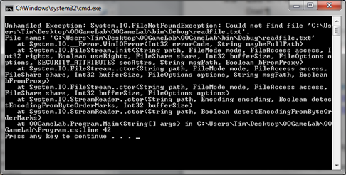
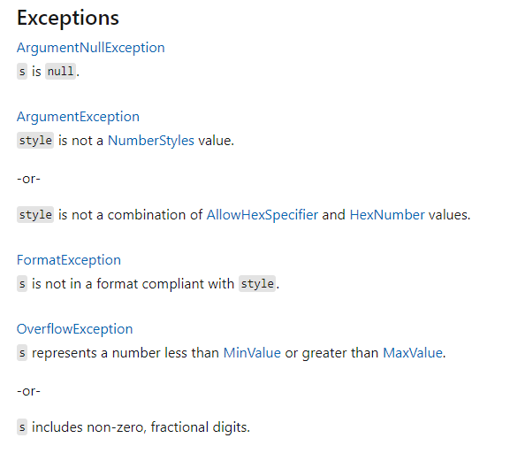

## Exception handling

Het wordt tijd om de olifant in de kamer te benoemen. Het wordt tijd om een bekentenis te maken... Ben je er klaar voor?! Hier komt ie. Luister goed, maar zeg het niet door: we hebben al de hele tijd informatie voor je achter gehouden! Ja, sorry, het was sterker dan mezelf. Maar we deden het voor jou. Het was de enige manier om ervoor te zorgen dat je leerde programmeren zonder constant bugs in je code achter te laten. Dus ja, hopelijk neem je het ons niet kwalijk?! Het wordt tijd om **exception handling** er bij te halen! Een essentiële programmeertechniek die ervoor zorgt dat je programma minder snel zal crashen indien er zich **uitzonderingen** tijdens de uitvoer voordoen. 


Wat een dramatische start zeg. Waar was dat voor nodig?! De reden is eenvoudig: met exception handling kan je code schrijven die al jouw slecht geschreven als het ware verstopt met een zacht dekentje, waardoor het voor de eindgebruiker zal lijken dat jouw programma vlekkeloos werkt. Niets is echter waar, het dekentje verstopt een smeltkroes van stinkende, gure, code die om de haverklap faalt en meer bugs bevat dan Windows Millennium. Kortom, lees verder: maar besef dat exception handling een tweesnijdend zwaar is.


### Waarom exception handling?

Veel fouten in je code zijn het gevolg van:

* Het aanroepen van data die er niet is (bijvoorbeeld een bestand dat werd verplaatst of hernoemd of het wegvallen van het wifi-signaal net wanneer je programma iets van een online database nodig heeft).
* Foute invoer door de gebruiker (bijvoorbeeld de gebruiker voert een letter in terwijl het programma aan getal verwacht).
* Programmeerfouten (bijvoorbeeld de programmeur gebruikt een object dat nog niet met de new operator werd geïnitialiseerd, of een deling door nul in een complexe berekening).

Voorgaande zaken zijn niet zozeer fouten dan wel uitzonderingen (**exceptions**). Ze doen zich zelden voor, maar hebben wel een invloed op de correcte uitvoer van je programma. Je programma zal met deze uitzonderingen rekening moeten houden wil je een gebruiksvriendelijk programma hebben. Veel uitzonderingen gebeuren buiten de wil van het programma om, maar kunnen wel gebeuren (wifi weg, foute invoer, etc.).  Door deze uitzonderingen af te handelen (*exception handling*) in je code kunnen we ons programma alternatieve opdrachten geven bij het optreden van een uitzondering.

Je zal zelf al geregeld exceptions zijn tegengekomen in je console programma's. Wanneer je je programma gewoon uitvoert en er verschijnt plots een hele hoop tekst (met onder andere het woord "Exception" in) gevolgd door het prompt afsluiten ervan, dan heb je dus een exception gegenereerd die je niet hebt afgehandeld.



Je moet zelfs niet veel moeite doen om uitzonderingen te genereren. Denk maar aan volgende voorbeeld waarbij je een exception kan genereren door een 0 in te geven, of iets anders dan een getal.

```csharp
Console.WriteLine("Geef een getal aub");
int noemer = Convert.ToInt32(Console.ReadLine());
double resultaat = 100/noemer;
Console.WriteLine($"100/{noemer} is gelijk aan {resultaat}");
```

### Exception handling met try en catch

Het mechanisme om exceptions af te handelen in C# bestaat uit 2 delen:

* Een ``try`` blok: binnen dit blok staat de code die je wil controleren op uitzonderingen omdat je weet dat die hier kunnen optreden.
* Een of meerdere ``catch``-blokken: dit blok zal mogelijk exceptions die in het bijhorende try-block voorkomen opvangen. Met andere woorden: in dit blok *staat de code die de uitzondering zal verwerken* zodat het programma op een deftige manier verder kan of meer elegant zichzelf afsluiten (*graceful shutdown*).

De syntax is als volgt (let er op dat de catch blok onmiddellijk na het try-blok komt):

```java
try
{
    //code waar exception mogelijk kan optreden
}
catch ()
{
    //exception handling code hier
}
```

### Een try catch voorbeeld

In volgend stukje code kunnen uitzonderingen optreden zoals we zonet zagen:

```java
string input = Console.ReadLine();
int converted = Convert.ToInt32(input)
```

Een ``FormatException`` zal optreden wanneer de gebruiker tekst of een kommagetal invoert. De conversie verwacht dit niet. ``Convert.ToInt32()`` kan enkel werken met gehele getallen.

We tonen nu hoe we dit met exception handling kunnen opvangen:

```java
try
{
    string input = Console.ReadLine();
    int converted = Convert.ToInt32(input);
}
catch ()
{
    Console.WriteLine("Verkeerde invoer!");
}
```

Indien er nu een uitzondering optreedt dan zal de tekst "Verkeerde invoer" getoond worden. Vervolgens gaat het programma verder met de code die mogelijk na het ``catch``-blok staat.


Merk op dat voorgaande code eleganter kan opgelost worden met ``TryParse`` wat we in het appendix van het vorige boek hebben uitgelegd.


### Meerdere catchblokken

`Exception` is een klasse van het .NET framework. Er zijn van deze basis-klasse meerdere Exception-klassen afgeleid die een specifieke uitzondering behelzen. Enkele veelvoorkomende zijn:

| Klasse   |  Omschrijving  |
|----|----|
|`Exception`|	Basisklasse|
|`SystemException`|	Klasse voor uitzonderingen die niet al te belangrijk zijn en die mogelijk verholpen kunnen worden.|
|`IndexOutOfRangeException`|	De index is te groot of te klein voor de benadering van een array|
|`NullReferenceException`|	Benadering van een niet-geïnitialiseerd object |

Je kan in het catch blok aangeven welke soort exceptions je wil vangen in dat blok. Als je bijvoorbeeld alle Exceptions wil opvangen schrijf je:

```java
catch (Exception e)
{
}
```

Hiermee vangen we dus **alle** Exceptions op, daar alle Exceptions van de klasse `Exception` afgeleid zijn en dus ook zelf een `Exception` zijn (=polymorfisme eigenschap, wat we verderop in dit boek zullen ontdekken).

We kunnen nu echter ook specifieke exceptions opvangen. De truc is om de meest algemene exception onderaan te zetten en naar boven toe steeds specifieker te worden. We maken een soort fallthrough mechanisme (wat we ook in een ``switch`` al hebben gezien). 

Stel bijvoorbeeld dat we weten dat de `FormatException` kan voorkomen en we willen daar iets mee doen. Volgende code toont hoe dit kan:

```java
try
{
    //...
}
catch (FormatException e)
{
    Console.WriteLine("Verkeerd invoerformaat");
}
catch (Exception e)
{
    Console.WriteLine("Exception opgetreden");
}
```

Indien een ``FormatException`` optreedt dan zal het eerste catch-blok uitgevoerd worden, in alle andere gevallen het tweede. Het tweede blok zal niet uitgevoerd worden indien een ``FormatException`` optreedt.

### Welke exceptions worden gegooid?

De online .NET documentatie is de manier om te weten te komen welke exceptions een methode mogelijk kan gooien. Gaan we bijvoorbeeld naar de documentatie op MSDN van de ``int32.Parse`` methode dan zien we daar een sectie "Exceptions" waar klaar en duidelijk wordt beschreven wanneer welke exception wanneer wordt opgeworpen.


<!--- {width:60%} --->


### Werken met de exception parameter

De Exceptions die worden opgegooid door een methode zijn objecten van de Exception-klasse. Deze klasse bevat standaard een aantal interessante zaken, die je kan oproepen in je code.

Bovenaan de declaratie van het ``catch``-blok geef je aan hoe het exception object in het blok zal heten. In de vorige voorbeelden was dit altijd `e` (standaardnaam)

Alle ``Exception``-objecten bevatten volgende informatie:

| Element	|Omschrijving|
|----|----|
|`Message`|	Foutmelding in relatief eenvoudige taal|
|`StackTrace`|	Lijst van methoden die de exception hebben doorgegeven|
|`TargetSite`|	Methode die de exception heeft gegeneerde (staat bij StackTrace helemaal bovenaan)|
|`ToString()`	|Geeft het type van de exception, Message en StackTrace terug als string.|


We kunnen via deze parameter meer informatie uit de opgeworpen uitzondering uitlezen en bijvoorbeeld aan de gebruiker tonen:

```java
catch (Exception e)
{
    Console.WriteLine("Exception opgetreden");
    Console.WriteLine("Message:"+e.Message);
 
    Console.WriteLine("Targetsite:" + e.TargetSite);
    Console.WriteLine("StackTrace:" + e.StackTrace);
}
```



**Opgelet**: vanuit security standpunt is het zelden aangeraden om Exception informatie zomaar rechtstreeks naar de gebruiker te sturen. Mogelijk bevat de informatie gevoelige informatie en zou deze door kwaadwillige gebruikers kunnen misbruikt worden om bugs in je programma te vinden.



<!---NOBOOKSTART--->
# Kennisclip

* [Werken met exception](https://ap.cloud.panopto.eu/Panopto/Pages/Viewer.aspx?id=f0d75032-e9bc-46e8-9a36-acb400b24318)
<!---NOBOOKEND--->
