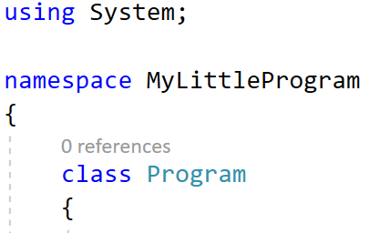
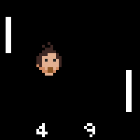

# Object Oriented Programming

<!---NOBOOKSTART--->
<!---Object Oriented Programming of korter OOP is een techniek afkomstig van higher level programmeertalen zoals Java, C#, VB.NET, ... en vindt zijn oorsprong bij Smalltalk die het eerst de term Object Oriented Programming introduceerde.

In recentere jaren heeft deze techniek echter ook zijn weg gevonden naar webscripting talen zoals Python, Ruby, Perl en zelfs PHP.

OOP streeft ernaar om een project zo structureel mogelijk op te bouwen in objecten. Dit heeft voor de programmeur het grote voordeel dat code vanaf nu in logische componenten wordt opgedeeld en veel makkelijker te hergebruiken is.

Om het concept van objecten te illustreren wordt meestal een voorwerp uit het dagelijks leven als voorbeeld gebruikt. Neem bijvoorbeeld een auto. De auto is het object en dit object heeft bepaalde properties of eigenschappen. Een eigenschap van de auto kan een band, een deur, een spiegel, de uitlaat of eender welk ander onderdeel van de auto zijn. Maar een auto heeft ook methoden. Een methode kan starten of remmen zijn.

Dus hebben we nu eigenlijk een object met properties en methoden. Zo zit een object in programmeertalen er ook uit. Een mail object heeft bijvoorbeeld als property de ontvanger, de verzender en het bericht en als methode versturen. Dit zijn natuurlijk erg vereenvoudigde voorbeelden en in de praktijk zal het er een stuk ingewikkelder aan toe gaan maar de basisprincipes zijn steeds hetzelfde. [Bron van deze introductie](https://www.inventis.be/blog/webdevelopment/de-voordelen-van-object-georienteerd-programmeren/145/).--->

<!---NOBOOKEND--->
## OOP?!

 In het vorige boek leerden we eigenlijk *gestructureerd programmeren* wat een zogenaamd programmeerparadigma is uit de jaren zestig. Hierbij schrijven we code gebruik makend van methoden, loops en beslissingsstructuren (``if``). Op zich blijft dit een erg nuttige manier van programmeren, wanneer we echter bij complexere applicaties komen dan merken we dat met gestructureerd programmeren we redelijk snel tot minder intuïtieve en soms heel complexe code aanbelanden. 
 
 Dat moet dus anders kunnen. Komt u binnen, **Object georiënteerd programmeren** (**OOP**). OOP is een manier van programmeren (*programmeerparadigma*) die voortbouwt op gestructureerd programmeren, maar die toelaat veel krachtigere applicaties te ontwikkelen.

 
 Bij OOP draait alles rond *klassen en objecten* die intern nog steeds gestructureerde code zullen bevatten (loops, methoden en beslissingsstructuren), maar die onze code (hopelijk) een pak overzichtelijker en minder complex gaan maken. Dankzij OOP gaan we onze code meer modulair, leesbaarder en onderhoudsvriendelijker maken.

### C# en OOP
Toen C# werd ontwikkeld in 2001 was een van de hoofddoelen van de programmeertaal om "een eenvoudige, moderne, objectgeoriënteerde programmeertaal voor algemene doeleinden" te worden (Bron:[Wikipedia](https://nl.wikipedia.org/wiki/C%E2%99%AF)). C# is van de grond af opgebouwd met het OOP programmeerparadigma in het achterhoofd. 

Wanneer we nieuwe programma's in C# ontwikkelen dan zagen we hier reeds bewijzen van:


De klasse ``Program`` zorgt ervoor dat ons programma voldoet aan de C# afspraken die zeggen dat bijna alle C# code in klassen moet staan. 
<!---NOBOOKSTART--->

<!---NOBOOKEND--->
<!---{aside}--->
<!--- {float:right, width:50%} --->

Duizend mammoeten en sabeltandtijgers! Ik dacht dat ik nu wel mee zou zijn met alles wat C# me zou voorschotelen. Helaas, wolharige neushoorn-kaas, niet dus. Ik ga een voorspelling doen:  van alle hoofdstukken in dit boek, wordt dit hoofdstuk hetgene waar je hebt meest je tanden op gaat stuk bijten. Hou dus vol, geef niet te snel op en kom geregeld hier terug! Succes gewenst. 
<!---{/aside}--->
<!---NOBOOKSTART--->

<!---NOBOOKEND--->

### Een wereld zonder OOP: Pong
Om de kracht van OOP te demonstreren gaan we een applicatie van lang geleden (deels) herschrijven gebruik makende van de kennis van gestructureerd programmeren (zie het boek *Zie Scherp*). We gaan de arcadehal klassieker "Pong" namaken, waarbij we als doel hebben om een balletje alvast op het scherm te laten botsen. Een rudimentaire oplossing zou de volgende kunnen zijn:

```java
int balx = 20;
int baly = 20;
int vx = 2;
int vy = 1;

while (true)
{
    //Xvector van richting veranderen aan de randen
    if (balx + vx >= Console.WindowWidth || balx - Math.Abs(vx) < 0)
    {
        vx = -vx;
    }
    //Xupdaten
    balx = balx + vx;

    //Yvector van richting veranderen aan de randen
    if (baly + vy >= Console.WindowHeight || baly - Math.Abs(vy) < 0)
    {
        vy = -vy;
    }
    //Yupdaten
    baly = baly + vy;

    //Output naar scherm sturen
    Console.SetCursorPosition(balx, baly);
    Console.Write("O");

    //Einde output
    System.Threading.Thread.Sleep(50);
    Console.Clear();
}
```

Hopelijk begrijp je deze code. Test ze maar eens in een programma. Zoals je zal zien krijgen we een balletje (``O``) dat over het scherm vliegt en telkens van richting verandert wanneer het aan de randen komt. De belangrijkste informatie zit natuurlijk in de variabelen ``balx``, ``baly`` die de huidige positie van het balletje bevatten. Voorts zijn ook ``vx`` en``vy`` belangrijk: hierin houden we bij in welke richting (en met welke snelheid) het balletje beweegt (een zogenaamde bewegingsvector).



Dit soort applicatie in C# schrijven met behulp van gestructureerde programmeer-concepten is redelijk eenvoudig. Maar wat als we nu 2 balletjes nodig hebben? Laten we even arrays links laten liggen en het gewoon eens naïef oplossen. Al na enkele lijnen kopiëren merken we dat onze code ongelooflijk rommelachtig gaat worden:

```java
int balx = 20;
int baly = 20;
int vx = 2;
int vy = 1;

int bal2x = 10;
int bal2y = 8;
int vx2 = 2;
int vy2 = -1;

while (true)
{
    //Xvector van richting veranderen aan de randen
    if (balx + vx >= Console.WindowWidth || balx - Math.Abs(vx) < 0)
    {
        vx = -vx;
    }
    if (bal2x + vx2 >= Console.WindowWidth || bal2x - Math.Abs(vx2) < 0)
    {
        vx2 = -vx2;
    }
    //Xupdaten
    balx = balx + vx;
    bal2x = bal2x + vx2;

    //enzovoort
```

Bijna iedere lijn code moeten we verdubbelen. Arrays zouden dit probleem deels kunnen oplossen, maar we krijgen dan in de plaats de complexiteit van werken met arrays op ons bord, wat voor 2 balletjes misschien wat overdreven is. 

### Een wereld met OOP: Pong
Uiteraard zijn we nu eventjes gestructureerd programmeren aan het demoniseren, dit is echter een bekende 21e eeuwse truukje om je punt te maken, dus we gaan nog even verder. 

Wanneer we Pong vanuit een OOP paradigma willen aanpakken dan is het de bedoeling dat we werken met klassen en objecten. Net zoals in het vorige boek ga ik je ook nu even in het diepe gedeelte van het bad gooien. Wees niet bang, ik zal je er tijdig uithalen (en je zal versteld staan hoeveel code je eigenlijk zult herkennen).

Om Pong in OOP te maken hebben we eerst een klasse nodig waarin we ons balletje gaan beschrijven, zonder dat we al een balletje hebben. En dat ziet er zo uit:

```java
class Balletje
{
    //Eigenschappen
    public int BalX { get; set; }
    public int BalY { get; set; }
    public int VX { get; set; }
    public int VY { get; set; }

    //Methoden
    public void Update()
    {
        //Xvector van richting veranderen aan de randen
        if (BalX + VX >= Console.WindowWidth || BalX - Math.Abs(VX) < 0)
        {
            VX = -VY;
        }

        //Xupdaten
        BalX = BalX + VX;

        //Yvector van richting veranderen aan de randen
        if (BalY + VY >= Console.WindowHeight || BalY - Math.Abs(VY) < 0)
        {
            VY = -VY;
        }
        //Yupdaten
        BalY = BalY + VY;
    }

    public void TekenOpScherm()
    {
        //Output naar scherm sturen
        Console.SetCursorPosition(BalX, BalY);
        Console.Write("O");      
    }
}
```


De code voor een nieuw klasse schrijf je best in een apart bestand in je project. Klik bovenaan in de menu balk op "Project" en kies dan "Add class...". Geef het bestand de naam "Balletje.cs".


Bijna alle code van zonet hebben we hier geïntegreerd in een ``class Balletje``, maar er zit duidelijk een nieuw sausje over. Vooral aan het begin zien we onze 4 variabelen terugkomen in een nieuw kleedje, namelijk als eigenschappen oftewel properties. Maar al lijkt de code grotendeels op wat we al kenden. En dat is goed nieuws. OOP gooit het vorige boek niet in de vuilbak, het gaat als het ware een extra laag over het geheel leggen. Let ook op het essentiële woordje ``class`` bovenaan, daar draait alles natuurlijk om. Klassen en objecten. 


Een klasse is een beschrijving van een groep 'dingen' of objecten.  Objecten zijn de "echte" dingen die werken volgens de beschrijving van de klasse. Ja ik heb zonet 2x hetzelfde verteld, maar het is essentiëel dat je het verschil tussen de termen **klasse** en **object** goed begrijpt. 


Laten we eens een **balletje-object** in het leven roepen. In de main schrijven we daarom dit:
```csharp
Balletje bal1 = new Balletje();
bal1.BalX = 20;
bal1.BalY = 20;
bal1.VX = 2;
bal1.VY = 1;
```

Ok, interessant. Die ``new`` heb je al gezien wanneer je met ``Random`` ging werken en de code erna is ook nog begrijpbaar: we stellen eigenschappen van het neuwe ``bal1`` object in. En nu komt ie: kijk hoe eenvoudig onze volledig main nu is geworden.

```csharp
static void Main(string[] args)
{
    Balletje bal1 = new Balletje();
    bal1.BalX = 20;
    bal1.BalY = 20;
    bal1.VX = 2;
    bal1.VY = 1;

    while (true)
    {
        bal1.Update();
        bal1.TekenOpScherm();

        //Einde output
        System.Threading.Thread.Sleep(50);
        Console.Clear();
    }
}
```

De loopcode is herleid tot 2 aanroepen van **methoden op het ``bal1`` object**: ``.Update()`` en ``.TekenOpScherm``. 

Run deze code maar eens. Yups, deze code doet exact hetzelfde als hiervoor. Ook nu krijgen we 1 balletje dat op het scherm rondbotst. 

En nu, abracadabra, kijk goed hoe eenvoudig onze code blijft als we 2 balletjes nodig hebben:

```csharp
Balletje bal1 = new Balletje();
bal1.BalX = 20;
bal1.BalY = 20;
bal1.VX = 2;
bal1.VY = 1;

Balletje bal2 = new Balletje();
bal2.BalX = 10;
bal2.BalY = 8;
bal2.VX = 2;
bal2.VY = -1;

while (true)
{
    bal1.Update();
    bal2.Update();
    bal1.TekenOpScherm();
    bal2.TekenOpScherm();
    //Einde output
    System.Threading.Thread.Sleep(50);
    Console.Clear();
}
```

Dit is de volledige code om 2 balletjes te hebben. Hoe mooi is dat?!

**De kracht van OOP zit hem in het feit dat we de logica IN DE OBJECTEN ZELF plaatsen. De objecten zijn met andere woorden verantwoordelijk om hun eigen gedrag uit te voeren.** In onze main zeggen we aan beide balletjes "update je zelf eens" , gevolgd door "update je zelf eens". 


Wanneer we 3 of meer balletjes zouden nodig hebben dan zullen we best arrays in de mix moeten gooien. Onze code blijft echter véél eenvoudigerén krachtiger dan wanneer we voorgaande met enkel kennis uit het vorige boek zouden maken.


Ok, zwem maar snel naar de kant. We gaan al het voorgaande van begin tot einde uit de doeken doen! Leg die handoek niet te ver weg, we gaan hem nog nodig hebben.

## Klassen en objecten

Een elementair aspect binnen OOP is het verschil beheersen tussen een klasse en een object.

Wanneer we meerdere objecten gebruiken van dezelfde soort dan kunnen we zeggen dat deze objecten allemaal deel uitmaken van een zelfde klasse. **Het OOP paradigma houdt ook in dat we de echte wereld gaan proberen te modeleren in code**. OOP laat namelijk toe om onze code zo te structureren zoals we dat ook in het echte leven doen. Alles (objecten) om ons heen behoord tot bepaalde verzamelingen (klassen) die deze groepen beschrijven. 

Neem eens een kijkje aan een druk kruispunt waar fietsers, voetgangers, auto's en allerlei andere zaken samenkomen[^jan]. Het is een erg hectisch geheel, toch kan je alles dat je daar zit in groepjes *classificeren*. We zien allemaal mens-objecten die tot de klasse van de Mens behoren. 
* Alle mensen hebben gemeenschappelijke eigenschappen (binnen deze beperkte context van een kruispunt): ze bewegen of staan stil (gedrag), ze hebben een bepaalde kleur van jas (eigenschap). 
* Alle auto's behoren tot een klasse Auto. Ze hebben gemeenschappelijke zaken zoals: ze hebben een bepaald bouwjaar (eigenschap), ze werken op een bepaalde vorm van energie (eigenschap) en ze staan stil of bewegen (gedrag).
* Ieder verkeerslicht behoort tot de klasse VerkeersLicht
* Fietsers tot de klasse Fietser.

[^jan]:Volgend voorbeeld is gebaseerd op de inleiding van het inzichtvolle boek "Handboek objectgeoriënteerd programmeren" door Jan Beurghs (EAN: 9789059406476)

### Definitie klasse en object

* **Een klasse** is een beschrijving en verzameling van dingen (objecten) met soortgelijke eigenschappen
* Een individueel **object** is een **instantie** van een klasse


Je zou dit kunnen vergelijken met het grondplan voor een huis dat tien keer in een straat zal gebouwd worden. Het plan met alle soortgelijke eigenschappen van ieder huis is de *klasse*. De effectieve huizen die we, gebaseerd op dat grondplan, bouwen zijn de instanties of objecten van deze klasse.





Nog een andere invalshoek:

Een andere invalshoek is de zogenaamde "dungeons" in veel online games. De makers van het spel hebben iedere dungeon in een klasse beschreven. Wanneer een groep avonturiers nu in zo'n grot gaat dan wordt voor die groep een aparte instantie (*instance*) van die grot gemaakt, gebasseerd op de klasse. Ze doen dit zodat iedere groep spelers mekaar niet voor de voeten loopt in 1 grot.






## Black-box principe
Een belangrijk concept bij OOP is het **Black-box** principe waarbij we de afzonderlijke objecten en hun werking als kleine zwarte dozen gaan beschouwen. 

Neem het voorbeeld van de auto: deze is in de echte wereld ontwikkeld volgens het blackbox-principe. De werking van de auto kennen tot in het kleinste detail is niet nodig om met een auto te kunnen rijden. De auto biedt een aantal zaken aan de buitenwereld aan (het stuur, pedalen, het dashboard), wat we de **interface** noemen, die je kan gebruiken om de interne staat van de auto uit te lezen of te manipuleren. Stel je voor dat je moest weten hoe een auto volledig werkte voor je ermee op de baan kon...

Binnen OOP wordt dit blackbox-concept **encapsulatie** genoemd. Het doel van OOP is andere programmeurs (en jezelf) zoveel mogelijk af te schermen van de interne werking van je code. Vergelijk het met de methoden uit het vorige boek: "if it works, it works" en dan hoef je niet in de code van de methode te gaan zien wat er juist gebeurt telkens je de methode wil gebruiken


### Objecten in de woorden van Steve Jobs

Steve Jobs, de oprichter van Apple, was een fervent fan van OOP. In een interview, way back, gaf hij volgende uitstekende uitleg[bron](https://fossbytes.com/steve-jobs-tells-the-best-definition-of-object-oriented-programming/):


> **Jeff Goodell**: Would you explain, in simple terms, exactly what object-oriented software is?

> **Steve Jobs**: Objects are like people. They’re living, breathing things that have knowledge inside them about how to do things and have memory inside them so they can remember things. And rather than interacting with them at a very low level, you interact with them at a very high level of abstraction, like we’re doing right here.

> Here’s an example: If I’m your laundry object, you can give me your dirty clothes and send me a message that says, “Can you get my clothes laundered, please.” I happen to know where the best laundry place in San Francisco is. And I speak English, and I have dollars in my pockets. So I go out and hail a taxicab and tell the driver to take me to this place in San Francisco. I go get your clothes laundered, I jump back in the cab, I get back here. I give you your clean clothes and say, “Here are your clean clothes.”

> You have no idea how I did that. You have no knowledge of the laundry place. Maybe you speak French, and you can’t even hail a taxi. You can’t pay for one, you don’t have dollars in your pocket. Yet, I knew how to do all of that. And you didn’t have to know any of it. All that complexity was hidden inside of me, and we were able to interact at a very high level of abstraction. That’s what objects are. They encapsulate complexity, and the interfaces to that complexity are high level.

En omdat het vloeken in de kerk is om Steve Jobs in een C# boek aan het woord te laten, hier wat Microsoft-oprichter Bill Gates over OOP te zeggen had:


[Bron](https://www.azquotes.com/quote/1470407)
