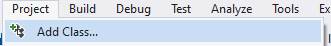

<!---{sample: true}--->
## OOP in C#

In C# kunnen we geen objecten aanmaken voor we een klasse hebben gedefinieerd dat de algemene eigenschappen (properties) en gedrag (methoden) beschrijft.


### Klasse maken

Een klasse heeft minimaal de volgende vorm:

```java
class ClassName
{

}
```


De naam die je een klasse geeft moet voldoen aan de identifier regels uit het eerste boek. Het is echter een goede gewoonte om **klassenamen altijd met een hoofdletter te laten beginnen**.



Volgende code beschrijft de klasse ``Auto`` in C#

```java
class Auto
{

}
```

Binnen het codeblock dat bij deze klasse hoort zullen we verderop dan de werking via properties en methoden beschrijven.

### Klassen in Visual Studio toevoegen

Je kan "eender waar" een klasse aanmaken in een project, maar het is een goede gewoonte om per klasse **een apart bestand** te gebruiken. Dit kan op 2 manieren.

Manier 1:
* In de Solution Explorer, rechterklik op je project.
* Kies "Add".
* Kies "Class..".
* Geef een goede naam voor je klasse.

Manier 2:
* Klik in de menubalk bovenaan op "Project".
* Kies "Add class..." .



### Objecten aanmaken

Je kan nu objecten aanmaken van de klasse die je hebt gedefinieerd. Dit kan op alle plaatsen in je code waar je in het verleden ook al variabelen kon declareren, bijvoorbeeld in een methode of je ``Main``-methode.

Je doet dit door eerst een variabele te definiëren en vervolgens een object te **instantiëren** met behulp van het ``new`` keyword. De variabele heeft als datatype ``Auto``:

```java
Auto mijnEersteAuto = new Auto();
Auto mijnAndereAuto = new Auto();
```

We hebben nu **twee objecten aangemaakt van het type Auto** die we verderop zouden kunnen gebruiken.

Let goed op dat je dus op de juiste plekken dit alles doet (bekijk de onderstaande screenshot):

* Klassen maak je aan als aparte files in je project.
* Objecten creëer je in je code op de plekken dat je deze nodig hebt, bijvoorbeeld in je ``Main`` methode bij een Console-applicatie.

### Klassen zijn gewoon nieuwe datatypes

In het vorige boek leerden we dat er allerlei datatypes bestaan. We maakten vervolgens variabelen aan van een bepaald datatype zodat deze variabele als inhoud enkel zaken kon bevatten van dat ene datatype. 

Zo leerden we toen volgende datatypes:
* **Valuetypes** zoals ``int``, ``char`` en ``bool``.
* Het **``enum``** keyword liet ons toe om een nieuw datatype te maken dat maar een eindig aantal mogelijke waarden (values) kon hebben. Intern bewaarden variabelen van zo'n enum-datatype hun waarde als een ``int``.
* **Arrays** waren het laatste soort datatypes. We ontdekten dat we arrays konden maken van eender welk datatype (valuetypes en enums) dat we tot dan kenden.

**Wel nu, klassen zijn niet meer dan een nieuw soort datatypes**. Kortom: telkens je een klasse aanmaakt, kunnen we in dat project variabelen en arrays aanmaken met dat datatype. We noemen variabelen die een klasse als datatype hebben **objecten**.

Het grote verschil dat deze objecten zullen hebben is dat ze dus vaak veel complexer zijn dan de eerdere datatypes die we kennen:
* Ze zullen meerdere "waarden" tegelijk kunnen bewaren (een ``int`` variabele kan maar één waarde tegelijkertijd in zich hebben).
* Ze zullen methoden hebben die we kunnen aanroepen om de variabele "voor ons te laten werken".


<!---{pagebreak} --->


<!---NOBOOKSTART--->

<!---NOBOOKEND--->
<!---{aside}--->
<!--- {float:right, width:50%} --->

Het blijft ingewikkeld hoor. Heel boeiend om de theorie van een speer te leren, maar ik denk dat ik toch beter een paar keer met een speer naar een mammoet werp om echt te voelen wat OOP is. 

Ik onthoud nu alvast **"klassen zijn gewoon een nieuwe vorm van complexere datatypes"** dan diegene die ik in het vorige boek heb geleerd? Ok?

**Correct. Er verandert dus niet veel. Enkel je variabelen worden krachtiger!**
<!---{/aside}--->
<!---NOBOOKSTART--->

<!---NOBOOKEND--->


<!---NOBOOKSTART--->

<!---NOBOOKEND--->
<!---{aside}--->
<!--- {float:right, width:50%} --->


**Klasse "``Studenten``" of "``Student``"?**

Veel beginnende programmeurs maken fouten op het correct kunnen onderscheiden wat de klassen en wat de objecten in hun opgave juist zijn.

Het is altijd belangrijk te begrijpen dat een klasse weliswaar beschrijft hoe alle objecten van dat type werken, maar op zich gaat die beschrijving steeds over 1 object uit de verzameling.

*Say what now?!*

Als je een klasse ``Student`` hebt, dan zal deze eigenschappen hebben zoals ``Punten``, ``Naam`` en ``DatumVanInschrijven``. 

Als je een klasse ``Studenten`` daarentegen hebt, dan is dit vermoedelijk een klasse die beschrijft hoe een groep studenten moet werken in je applicatie. Mogelijk zal je dan properties hebben zoals ``KlasNaam``, ``AantalAfwezigen``, etc. Kortom, eigenschappen over de groep, niet over 1 student.

**"``Level``" of "``Level1``"?**

Een andere veelgemaakte fout is klassen te schrijven, die maar exact één object kan en moet creëren (dit heet een *singleton*). Stel je voor dat je een spel maakt waarin verschillende levels zijn. Een logische keuze zou dan zijn om een klasse ``Level`` te maken (niét ``Levels``) die properties  heeft zoals ``MoeilijkheidsGraad``, ``HeeftGeheimeGrotten``, ``AantalVijanden``, etc.

Vervolgens kunnen we dan instanties maken: *1 object stelt 1 level in het spel voor*. De speler kan dan van level naar level gaan en de code start dan bijvoorbeeld telkens de ``BeginLevel`` methode:

```java
Level level1 = new Level();

level1.BeginLevel();
```

Wat dus niet mag zijn **klassen** met namen zoals ``level1``, ``level2``, etc. Vermoedelijk hebben deze klasse 90% gelijkaardige code en is er dus een probleem met wat we de *architectuur* van je code zouden kunnen noemen. Of duidelijker: je snapt niet wat het verschil is tussen klassen en objecten!
Objecten met namen zoals ``level1`` en ``level2`` zijn wél dus toegestaan, daar ze dan vermoedelijk allemaal van het type ``Level`` zijn. Maar opgelet: als je variabelen hebt die een genummerd zijn (bv ``bal1``, ``bal2``, etc.) dan is de kans groot dat je vervolgens een array van objecten nodig hebt! 

<!---{/aside}--->
<!---NOBOOKSTART--->

<!---NOBOOKEND--->

<!---{sample: false}--->

<!---{pagebreak} --->