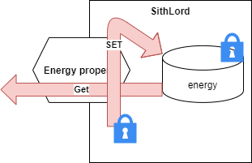

## Properties

We zagen zonet dat instantievariabele nooit ``public`` mogen zijn om te voorkomen dat de buitenwereld onze objecten 'vult' met slechte zaken. Het voorbeeld waarbij we vervolgens een methode ``VeranderLeefijd`` gebruikten om op gecontroleerde manier toch aan de interne staat van objecten te komen is één oplossing, maar een nogal oldschool oplossing. 

Deze manier van werken - methoden gebruiken om instantievariabelen aan te passen of uit te lezen- is wat voorbijegestreefd binnen C#. Onze programmeertaal heeft namelijk het concept **properties** (*eigenschappen*) in het leven geroepen die toelaten op een veel eenvoudigere manier aan de interne staat van objecten te komen.


Properties (*eigenschappen*) zijn de C# manier om objecten hun interne staat in en uit te lezen.
Ze zorgen voor een gecontroleerde toegang tot de interne structuur van je objecten.



### Star Wars en de nood aan properties 

In het Star Wars universum heb je goede oude "Darth Vader". Hij behoort tot de mysterieuze klasse van de Sith Lords. Deze lords lopen met een geheim rond: ze hebben een zogenaamde Sithnaam, een naam die ze enkel mogen bekend maken aan andere Sith Lords, maar niet anders. Voorts heeft een Sith Lord ook een hoeveelheid energie (*The Force*) waarmee hij kattekwaad kan uithangen. Deze energie mag natuurlijk nooit onder nul gezet worden.


We kunnen voorgaande als volgt schrijven:
```java
class SithLord
{
    private int energy;
    private string sithName;
}
```

**Het is uit den boze dat we eenvoudige data fields (``energy`` en ``name``) ``public`` maken.** Zouden we dat wel doen dan kunnen externe objecten deze geheime informatie uitlezen!

```java
SithLord Palpatine= new SithLord();
Console.WriteLine(Palpatine.sithName); //DIT ZAL DUS NIET WERKEN, daar sithName private is.
```

We willen echter wel van buiten uit het energy-level van een sithLord kunnen instellen. Maar ook hier hetzelfde probleem: wat als we de energy-level op -1000 instellen? Terwijl energy nooit onder 0 mag gaan.

### 2 soorten properties
**Properties** lossen dit probleem dus op*

Er zijn 2 soorten properties in C#:
*  **Full Properties**: deze stijl van properties verplicht ons véél code te schrijven, maar we hebben ook volledige controle over wat er gebeurt.
* **Auto properties** zijn exact het omgekeerde van full properties: weinig code, maar ook weinig controle/impact


We behandelen eerst full properties, daar auto properties een soort afgeleide van full properties zijn (bepaalde aspecten van full properties worden bij auto properties achter de scherm verstopt zodat jij als programmeur er geen last van hebt).


### Full properties

Properties herken je aan de ``get`` en ``set`` keywords in een klasse. Een property is een beschrijving van wat er moet gebeuren indien je informatie uit (``get``) een object wilt halen of informatie net in (``set``) een object wilt plaatsen.

In volgende voorbeeld maken we een property, genaamd ``Energy`` aan. Deze doet niets anders dan rechtstreeks toegang tot de instantievariabele ``energy`` te geven:

```java
class SithLord
{
    private int energy;

    public int Energy
    {
        get
        {
            return energy;
        }
        set
        {
            energy=value;
        }
    }
}
```

Dankzij deze code kunnen we nu buiten het object de property ``Energy`` gebruiken als volgt:

```java
SithLord Vader= new SithLord();
Vader.Energy= 20; //set
Console.WriteLine($"Vaders energy is {Vader.Energy}"); //get
```

Laten we eens inzoomen op de full property code:

<!---{line-numbers:true}--->
```java
public int Energy
{
    get
    {
        return energy;
    }
    set
    {
        energy=value;
    }
}
```


#### Full property:  identifier en datatype
De eerste lijn van een ful property beschrijft de naam (identifier) en datatype van de property: ``public int Energy``

**Een property is altijd ``public``** daar dit de essentie van een property net is "de buitenwereld gecontroleerde toegang tot de interne staat van een object geven.

Vervolgens zeggen we wat voor **datatype** de property moet zijn en geven we het een naam die moet voldoen aan de identifier regels van weleer. Voor de buitenwereld zal een property zich gedragen als een gewone variabele, met de naam ``Energy`` van het type ``int``.


Indien je de property gaat gebruiken om een instantievariabele naar buiten beschikbaar te stellen, dan is het een goede gewoonte om dezelfde naam als dat veld te nemen maar nu met een hoofdletter. (dus ``Energy`` i.p.v. ``energy``).

#### Full property: get gedeelte

Indien je wenst dat de property data **naar buiten** moet sturen, dan schrijven we de get-code. Binnen de accolades van de ``get`` schrijven we wat er naar buiten moet gestuurd worden.

```java
get
{
    return energy;
}
```

Dit werkt dus identiek aan een methode met een returntype, ``int`` in dit geval.**Het element dat je return't in de get code moet uiteraard van hetzelfde type zijn als waarmee je de property hebt gedefinieerd (``int`` in dit geval).**


We mogen eender wat doen in het get-gedeelte (net zoals bij methoden) zolang er finaal maar iets uitgestuurd wordt m.b.v. ``return``. We gaan hier verderop dieper op in, want soms is het handig om *getters* te schrijven die de data transformeren voor ze uitgestuurd wordt.


We kunnen nu van buitenaf toch de waarde van ``energy`` uitlezen via de property en het get-gedeelte, bijvoorbeeld  ``int uitgelezen =Palpatine.Energy;``.

#### Full property: set gedeelte

In het set-gedeelte schrijven we de code die we moeten hanteren indien men van buitenuit een waarde aan de property wenst te geven om zo een instantievariabele aan te passen. 

De waarde die we van buitenuit krijgen (als een parameter zeg maar) zal **altijd** in een lokale variabele ``value`` worden bewaard binnenin de get-code. Deze zal van het type van de property zijn. 

Vervolgens kunnen we ``value`` toewijzen aan de interne variabele indien gewenst: ``energy=value;`` . Uiteraard kunnen we die toewijzing dus ook gecontroleerd laten gebeuren, wat we in volgende deel zullen uitleggen.

We kunnen vanaf nu van buitenaf waarden toewijzen aan de property en zo ``energy`` toch bereiken: ``Palpatine.Energy=50``.


Je bent dus niet verplicht om een property te maken wiens naam overeen komt met een bestaande instantievariabele. Dit mag dus ook:

```java
class Auto
{
    private int benzinePeil;

    public int FuelLevel
    {
        get { return benzinePeil; }
        set { benzinePeil = value; }
    }
}
```



**Snel properties schrijven**

Visual Studio heeft een ingebouwde snippet om snel een full property, inclusief een bijhorende private instantievariabele, te schrijven. **Typ ``propfull`` gevolgd door twee tabs**



### Full property met toegangscontrole
De full property ``Energy`` heeft nog steeds het probleem dat we negatieve waarden kunnen toewijzen (via de ``set``) die dan vervolgens zal toegewezen worden aan ``energy``.

**Properties hebben echter de mogelijkheid om op te treden als wachters van en naar de interne staat van objecten.**

We kunnen in de ``set`` code extra controles inbouwen. Daar de ``value`` variabele de waarde krijgt die we aan de property van buiten af geven, kunnen we deze dus controleren en , indien nodig, bijvoorbeeld niet toewijzen. Volgende voorbeeld zal enkel de waarde toewijzen indien deze groter of gelijk aan 0 is:

```java
public int Energy
{
    get
    {
        return energy;
    }
    set
    {
        if(value>=0)
            energy=value;
    }
}
```

Volgende lijn zal dus geen effect hebben:
`` Palpatine.Energy=-1;``

We kunnen de code binnen ``set`` (en ``get``) zo complex maken als we willen. 

<!---{sample: true}--->
### Property variaties
We zijn niet verplicht om zowel de ``get`` en de ``set`` code van een property te schrijven. Dit laat ons toe om een aantal variaties te schrijven:
* Write-only property: heeft geen ``get``.
* Read-only property: heeft geen  ``set``.
* Read-only property met private ``set`` (het omgekeerde , een private ``get``, zal je zelden tegenkomen).
* Read-only property die data transformeert: **deze ga je véél kunnen gebruiken**.


#### Write-only property


```java
   public int Energy
    {
        set
        {
            if(value>=0)
                energy=value;
        }
    }
```
We kunnen dus enkel ``energy`` een waarde geven, maar niet van buitenuit uitlezen.

#### Read-only property


```java
   public int Energy
    {
        get
        {
            return energy;
        }
    }
```
We kunnen  enkel ``energy`` van buitenuit uitlezen, maar niet aanpassen.



**Opgelet: het ``readonly`` keyword heeft andere doelen en wordt NIET gebruikt in C# om een readonly property te maken**



#### Read-only property met private set



Soms gebeurt het dat we van buitenuit enkel de gebruiker de property read-only willen maken. We willen echter intern (in de klasse zelf) nog steeds controleren dat er geen illegale waarden aan private instantievariabelen worden gegeven. Op dat moment definiëren we een read-only property met een private setter:

```java
   public int Energy
    {
        get
        {
            return energy;
        }
        private set
        {
            if(value>=0)
                energy=value;
        }
    }
```

Van buitenuit zal enkel code werken die de ``get`` van deze property aanroept: ``Console.WriteLine(Palpatine.Energy);``. Code die de ``set`` van buitenuit nodig heeft zal een fout geven zoals: ``Palpatine.Energy=65``; ongeacht of deze geldig is of niet.

<!---NOBOOKSTART--->

<!---NOBOOKEND--->
<!---{aside}--->
<!--- {float:right, width:50%} --->


Lukt het een beetje? Properties zijn in het begin wat overweldigend, maar geloof me: ze zijn zowat dé belangrijkste bewoners in de .NET/C# wereld.


**Nu even goed opletten**: indien we IN het object de instantievariabelen willen aanpassen  dan is het een goede gewoonte om dat **via de property** te doen (ook al zit je in het object zelf en heb dus eigenlijk de property niet nodig). Zo zorgen we ervoor dat de bestaande controle in de property niet omzeilt worden.

Kijk zelf naar volgende **slechte** code:
```java
class SithLord
{
    private int energy;
    private string sithName;

    public void ResetLord()
    {
        energy=-1;
    }

    public int Energy
    {
        get
        {
            return energy;
        }
        private set
        {
            if(value>=0)
                energy=value;
        }
    }
}
```

De nieuw toegevoegde methode ``ResetLord`` willen we gebruiken om de lord z'n energy terug te verlagen. Door echter ``energy=-1;`` te schrijven geven we dus -1 rechtstreeks aan ``energy``. Nochtans is dit een illegale waarde volgens de set-code van de property.

**We moeten dus in de methode ook expliciet via de property gaan** om bugs te voorkomen en dus gaan we in ``ResetLord``schrijven naar de property ``Energy``  én niet rechtstreeks naar de instantievariabele ``energy``:

```java
public void ResetLord()
{
    Energy=-1; // Energy i.p.v. energy
}
```
<!---{/aside}--->
<!---NOBOOKSTART--->

<!---NOBOOKEND--->


**Het is dus een goede gewoonte om zo vaak mogelijk via de properties je interne variabele aan te passen en niet rechtstreeks via de instantievariabele zelf.**



#### Read-only properties die transformeren


Je bent uiteraard niet verplicht om voor iedere instantievariabele een bijhorende property te schrijven. Omgekeerd ook: mogelijk wil je extra properties hebben voor data die je 'on-the-fly' kan genereren dat niet noodzakelijk uit een instantievariabele komt.

Stel dat we volgende klasse hebben:
```java
class Persoon
{
    private string voornaam;
    private string achternaam;
}
```
We willen echter ook soms de volledige naam of emailadres krijgen, beide gebaseerd op de inhoud van de instantievariabelen ``voornaam`` en ``achternaaù``. Via een read-only property die transformeert kan dit:
```java
class Persoon
{
    private string voornaam;
    private string achternaam;
    public string FullName
    {
        get
        { 
            return $"{voornaam} {achternaam}";
        }
    }
    public string Email
    {
        get
        {
            return $"{voornaam}.{achternaam}@ap.be";
        }
    }
}
```

Of nog eentje waarin zelfs geen achterliggende instantievariabele bestaat:
```java
class Aarde
{
    public double ZwaarteKracht
    {
        get
        {
            return 9.81;
        }
    }
}
```

Nog een voorbeeldje:

```java
class Persoon
{
    private int age;

    public bool IsWaarschijnlijkNogLevend
    {
        get
        {
            if(age>120) 
                return false;
            return true;
        }
    }
}
```

Vaak gebruiken we dit soort read-only properties om data te transformeren. Hoe minder code een klasse bevat hoe beter. Indien je de leeftijd van een persoon *in maanden* in de klasse bijhoudt, dan is het onnodig om dat ook te doen voor de *leeftijd in jaren*. We kunnen dan beter die informatie genereren gebaseerd op de data die we hebben:
```java
class Persoon
{
    private int leeftijd; //in maanden

    public double LeeftijdInJaren
    {
        get
        {
            return leeftijd / 12.0;
        }
    }
}
```

## Auto properties
Automatische eigenschappen (**autoproperties** , soms ook *autoprops* genoemd) laten toe om snel properties te schrijven zonder dat we de achterliggende instantievariabele moeten beschrijven.

Heel vaak wil je heel eenvoudige variabelen aan de buitenwereld van je klasse beschikbaar stellen. Omdat je instantievariabelen echter niet ``public`` mag maken, moeten we dus properties gebruiken die niets anders doen dan als doorgeefluik fungeren. Autoproperties doen dit voor ons: het zijn vereenvoudige full properties waarbij de achterliggende instantievariabele onzichtbaar voor ons is.

Zo kan je eenvoudige de volgende klasse ``Persoon`` herschrijven met behulp van autoproperties. 

De originele klasse mét full properties:

```java
public class Person
    {
 
        private string firstName;
        private string lastName;
        private int age;
 
        public string FirstName
        {
            get
            {
                return firstName;
            }
            set
            {
                firstName = value;
            }
        }
 
        public string LastName
        {
            get
            {
                return lastName;
            }
            set
            {
                lastName = value;
            }
        }
 
        public int Age
        {
            get
            {
                return age;
            }
            set
            {
                age = value;
            }
        }
    }
```

De herschreven klasse met autoproperties (autoprops) wordt: 

```java
public class Person
    {
 
        public string FirstName { get; set; }
        public string LastName { get; set; }
        public int Age { get; set; }
 
    }
```

Beide klassen hebben exact dezelfde functionaliteit, echter is de laatste klasse aanzienlijk eenvoudiger om te lezen en te typen. De private instantievariabelen zijn niét meer aanwezig. C# gaat dit voor z'n rekening nemen. Alle code zal dus via de properties moeten gaan.


Vaak zal je klassen eerst met autoproperties beschrijven. Naarmate de specificaties dan vereisen dat er bepaalde controles of transformaties moeten gebeuren, zal je stelselmatig autoprops vervangen door full props.

Dit kan trouwens automatisch in VS: selecteer de autoprop in kwestie en klik dan vooraan op de schrijvendraaier en kies "Convert to full property"




### Beginwaarden van autoprops

Je mag autoproperties beginwaarden geven door de waarde achter de property te schrijven, als volgt:

```java
public int Age {get;set;} = 45;
```

Al je objecten zullen nu als beginleeftijd 45 hebben (*arme objecten*).


### Altijd auto-properties? 
Merk op dat je dit enkel kan doen indien er geen extra logica in de property aanwezig moet zijn.

Stel dat je bij de setter van age wil controleren op een negatieve waarde, dan zal je dit zoals voorheen moeten schrijven en kan dit niet met een automatic property:

```java
set
{
    if( value > 0)
        age = value;
}
```
**Voorgaande property kan dus *NIET* herschreven worden met een automatic property.**


### Alleen-lezen eigenschap
Je kan autoproperties ook gebruiken om bijvoorbeeld een read-only property te definiëren. Als volgt:

Originele property:
```java
public string FirstName
{
    get
    {
        return firstName;
    }
}
```

Met autoprops:
```java
public string FirstName { get; private set; }
```

En uiteraard kunnen we dan de instantievariabele ``firstName`` uit de code verwijderen.

En andere manier die ook kan is als volgt:
```java
public string FirstName { get; }
```



### Snel autoproperties typen in Visual Studio:
Als je in Visual Studio in je code ``prop`` typt en vervolgens twee keer de tabtoets indrukt dan verschijnt al de nodige code voor een automatic property. Je hoeft dan enkel nog volgende zaken in orde te brengen:

* Het type van de property
* De naam van de property (identifier) 
* De toegankelijkheid van get/set (public, private, protected)

Via ``propg`` krijg je trouwwens een autoproperty met private setter.



<!---NOBOOKSTART--->

<!---NOBOOKEND--->
<!---{aside}--->
<!--- {float:right, width:50%} --->

**Methode of property?**

Een veel gestelde vraag bij beginnende OOP-ontwikkelaars is: "Moet dit in een property of in een methode geplaatst worden?"

De regels zijn niet in steen gebeiteld, maar ruwweg kan je stellen dat:
* Betreft het een actie of gedrag, iets dat het object moet doen (tekst tonen, iets berekenen of aanpassen, etc) dan plaats je het in een **methode**. 
* Betreft het een eigenschap die een bepaalde waarde heeft, dan gebruik je een **property**.

<!---{/aside}--->
<!---NOBOOKSTART--->

<!---NOBOOKEND--->

<!---{sample: false}--->