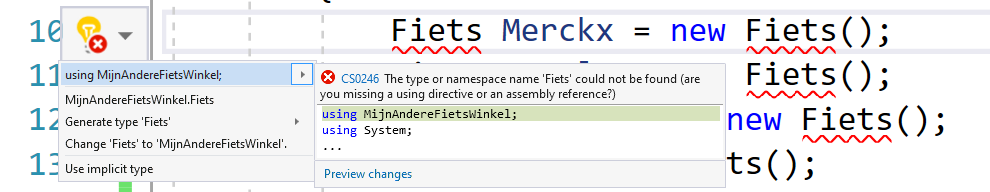

## Namespace en using
Als tussendoortje wil ik nu even de keywords ``using`` en  ``namespace`` met je bespreken. Je zal het keyword ``namespace`` al vele malen bovenaan je code hebben zien staan met vlak erboven meestal nog 1 vreemd zinnetje met het keyword ``using``.

```java
using System;

namespace MyEpicGame
{
    class Monster
```

De naam die achter de ``namespace`` staat is altijd die van je project, maar waarom is dit eigenlijk?

### Wat zijn namespaces
Een ``namespace`` wordt gebruikt om te voorkomen dat 2 projecten die toevallig dezelfde klassenamen hebben in conflict komen. 

Beeld je in dat je een project van iemand anders toevoegt aan jouw project en je ontdekt dat in dat project reeds een klasse ``Student`` aanwezig is. Hoe weet C# nu welke klasse moet gebruikt worden? Want mogelijk wens je beide te gebruiken!

De namespace rondom een klasse is als het ware een extra stukje naamgeving waarmee je kan aangeven welke klasse je juist nodig hebt. In bovenstaand stukje code heb ik een project ``MyEpicGame`` gemaakt en zoals je ziet bevat het een klasse ``Monster``. De volledige naam (of *path*) van deze klasse is ``MyEpicGame.Monster``. 

Als ik dus even later een project met volgende namespace, en zelfde klassenaam, importeer:

```java
using System;

namespace NietZoEpicGame
{
    class Monster
```
Dan kan ik deze klasse aanroepen als ``NietZoEpicGame``.

<!---NOBOOKSTART--->

<!---NOBOOKEND--->
<!---{aside}--->
<!--- {float:right, width:50%} --->

De politie uw vriend! Inderdaad. De auteur van dit boek heeft klachten gekregen over het feit dat hij het edele beroep van politie-agent ietwat besmeurd. We willen daarom even u attenderen en, zoals een goed agent, betaamd, u de weg doorheen de stad wijzen.

Als u ons  tegenkomt en vraagt "Waar is de Kerkstraat." Dan zullen wij u meer informatie moeten vragen. Zonder er bij te zeggen in welke gemeente u die straat zoekt, is de kans bestaande dat we u naar de verkeerde Kerkstraat sturen (er zijn er namelijk best veel in België en Nederland).

Wel, namespaces zijn exact dat. Een soort stadsnaam (of postcode) die essentiëel is bij een straatnaam om zonder verwarring een straat te kunnen identificeren, in dit geval dus de klassenaam.

Nog een fijne dag!
<!---{/aside}--->
<!---NOBOOKSTART--->

<!---NOBOOKEND--->

### Using in je code

Mogelijk heb je nu al een vermoeden waarom er ``using System;`` bovenaan je projecten staat. Deze lijn is verrassend eenvoudig en zegt letterlijk: *"Beste C#, als je een klasse zoekt en je vindt ze niet in dit project: kijk dan zeker in de System-bibliotheek."*

Alle basisklassen die we al hebben leren gebruiken zoals ``Math``, ``Console`` en ``Random`` staan in deze ``System``-namespace. 

Indien je de lijn ``using System;`` zou weghalen dan zou je de volledige naam van ```Console`` moeten schrijven:

```java
System.Console.WriteLine("Dit is wel veel meer typwerk");
```


### Ontbrekende namespaces terugvinden
Het gebeurt soms dat je een klasse gebruikt en je weet zeker dat ze in jouw project aanwezig is. Visual Studio kan je helpen de namespace van deze klasse te zoeken moest je daar te lui voor zijn.

Je doet dit door de naam van de klasse te schrijven (op de plek waar je deze nodig hebt) en dan op het lampje dat links in de rand verschijnt te klikken. Indien de klasse gekend is door VS zal je nu de optie krijgen om automatisch:
* oftewel  ``using``, met de juiste namespace, bovenaan je huidige codebestand te plaatsen.
* oftewel  de volledige naam van de klasse uit te schrijven (dus inclusief de namespace).



De optie ``Generate type ..`` zal je ook vaak kunnen gebruiken. Wanneer de klasse in kwestie (``Fiets`` hier) nog niet bestaat en je wilt deze automatische laten genereren (in een apart bestand) dan zal deze optie dat voor je doen. 


<!---NOBOOKSTART--->
<!---### De wereld van Nugets, dll's en class libraries--->
<!---NOBOOKEND--->


