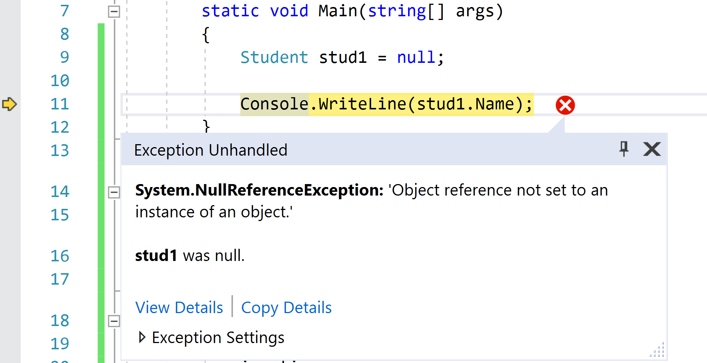

## Object referenties en null

Zoals nu duidelijk is bevatten variabelen steeds een referentie naar een object. Maar wat als we dit schrijven:

```java
Student stud1;
stud1.Naam = "Marc Jansens";
```

Dit zal een fout geven. Het object ``stud1`` bevat namelijk nog geen referentie. Maar wat dan wel?

Deze variabele bevat de waarde **``null``** . Net zoals bij value types die een default waarde hebben (bv. 0 bij een ``int`` ) als je er geen geeft, zo bevatten reference type variabelen altijd ``null``. 

``null`` is een waarde die je dus kan toekenen aan eender welk reference type (om aan te geven dat er nog geen referentie naar een effectief object in de variabele staat) en waar je dus ook op kan testen. 

Van zodra je een referentie naar een object (een bestaand of eentje dat je net met ``new`` hebt aangemaakt) aan een reference type variabele toewijst (met de ``=`` operator) zal de ``null`` waarde uiteraard overschreven worden.


Merk op dat de GC enkel op de heap werkt. Indien er in de stack dus een variabele de waarde ``null`` heeft zal de GC deze nooit verwijderen!


### NullReferenceException

Een veel voorkomende foutboodschap tijdens de uitvoer van je applicatie is de zogenaamde ``NullReferenceException``. Deze zal optreden wanneer je code een object probeert te benaderen wiens waarde ``null`` is (een onbestaande object met andere woorden).

Laten we dit eens simuleren:

```java
Student stud1 = null;

Console.WriteLine(stud1.Name);
```

Dit zal resulteren in volgende foutboodschap:

<!--- {width:60%} --->



We moeten in dit voorbeeld expliciet ``= null`` plaatsen daar Visual Studio slim genoeg is om je te waarschuwen voor eenvoudige potentiële NullReference fouten en je code anders niet zal compileren.


### NullReferenceException voorkomen

Objecten die niet bestaan zullen altijd ``null`` weergeven. Uiteraard kan je niet altijd al je code uitvlooien waar je misschien ``= new SomeObject();`` bent vergeten.

Voorts kan het ook soms by design zijn dat een object voorlopig ``null`` is.

Gelukkig kan je controleren of een object ``null`` is als volgt:

```java
if(stud1 == null)
    Console.WriteLine("Oei. Object bestaat niet.")
```

#### Verkorte null controle notatie

Vaak moet je dit soort code schrijven:

```java
if(stud1 != null)
{
    Console.WriteLine(stud1.Name)
}
```

Op die manier voorkom je ``NullReferenceException``. Het is uiteraard omslachtig om steeds die check te doen. Je mag daarom ook schrijven:

```java
Console.WriteLine(stud1?.Name)
```

Het vraagteken direct na het object geeft aan: *"Gelieve de code na dit vraagteken enkel uit te voeren indien het object voor het vraagteken niét null is".*

Bovenstaande code zal dus gewoon een lege lijn op scherm plaatsen indien ``stud1`` effectief ``null`` is, anders komt de naam op het scherm.

### Return null

Uiteraard mag je dus ook expliciet soms ``null`` teruggeven als resultaat van een methode. Stel dat je een methode hebt die in een array een bepaald object moet zoeken. Wat moet de methode teruggeven als deze niet gevonden wordt? Inderdaad, we geven dan ``null`` terug.

Volgende methode zoekt in een array van studenten naar een student met een specifieke naam en geeft deze terug als resultaat. Enkel als de hele array werd doorlopen en er geen match is wordt er ``null`` teruggegeven 
(de werking van arrays van objecten wordt later besproken): 

```java
static Student ZoekStudent(Student[] array, string naam)
{
    for (int i = 0; i < array.Length; i++)
    {
        if (array[i].Name == naam)
            return array[i];
    }

    return null;
}
```

<!---NOBOOKSTART--->
# Kennisclip

* [Referenties en null](https://ap.cloud.panopto.eu/Panopto/Pages/Viewer.aspx?id=d9117b52-7306-4e92-bf24-acb100b10697)
<!---NOBOOKEND--->
