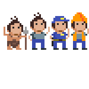

# Conclusie

Je hebt het gehaald! Volgens m'n statistieken zal je nu in 1 van volgende 2 staten zijn:
1. Het scheelt niet veel of je droomt in klassen en objecten. Overal waar je kijkt zie je toepassingen van polymorfisme, interfaces en overerving. Je begrijpt nu waarom zoveel mensen graag software ontwikkelen. Je hebt de smaak te pakken en er ligt een ongelooflijk scala aan mogelijkheden voor je klaar. Bekijk zeker enkele aanbevelingen op de volgende pagina die je na dit boek kan ontdekken. Ook in de appendix zal je nog enkele interessante, gevorderde concepten kunnen ontdekken.
2. Je pinkt een traantje weg. Je had zo gehoopt nu alles van OOP te kunnen, maar het is alleen maar verwarrender geworden. Dat is jammer, maar niets aan te doen. Bij sommigen komt de klik niet altijd direct. Hopelijk heb je toch iets geleerd uit dit boek en begrijp je waarom zoveel mensen, zoals ik, zo enthousiast over OOP zijn. Blijven oefenen is de boodschap!

In welke staat je ook bent: houdt sowieso  **ziescherp.be** in het oog. Ik ben nog niet gedaan met deze serie.

Ik wens je alvast veel succes met de verdere ontwikkeling van je programmeer-expertise en denk er aan: gebruik nooit **``goto``**!

Tim Dams
*Lente 2021*

