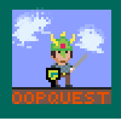

<!---{sample: true}--->

# Welkom
Welkom in deel 2 van de prestigieuze reeks die je op een gezellige manier de wondere wereld van C# wil doen ontdekken. Daar waar het vorige deel (*Zie Scherp*) geen programmeervoorkennis vereiste wordt er uiteraard in dit deel verwacht dat je reeds de basis van C# in de vingers hebt. Er zijn tal van prachtige boeken, sites en video's te vinden hieromtrent, maar uiteraard kan ik het niet laten om m'n eigen deel 1 te promoten, daar dit deel de rechtstreeks opvolger is. 

Dit boek wordt gebruikt in het tweede semester van de opleidingen professionele bachelor Elektronica-ICT en Toegepaste Informatica van de AP Hogeschool. Het is met andere woorden *op maat geschreven* voor jonge, enthousiaste jongelingen die niet bang zijn om al eens op een computer te werken of spelen. Uiteraard zijn ook niet-studenten erg welkom om dit boek te ontdekken. De enige vereiste is dat je zin hebt om de handen vuil te maken en om iets nieuws te leren. Het is eigenlijk contradictorisch maar mijn eerste raad wanneer ik dit vak doceer is altijd: "stop met lezen, start met programmeren!". Ik zou weer de oude analogie over "leren fietsen doe je ook niet uit een boek" kunnen oprakelen, maar dat ga ik niet doen... Oeps :)

Veel plezier met dit boek. Daar waar het vorige boek nog een gezellige wandel op een grasveld was, duiken we nu het bos in. Een bos waar achter iedere heuvel nieuwe dingen zullen ontdekt worden, maar waar ook soms gevaar loert als je niet oplet.

Let's go!

Tim Dams

*Lente 2021*

## Over de bronnen


Deze cursus wordt onder de Creative Commons 4.0 licentie uitgebracht. Dat wil zeggen dat u gerust deze cursus mag 'plunderen' voor eigen gebruik in bijvoorbeeld eigen lessen. Uiteraard mag dit onder de voorwaarde dat u duidelijk de originele bron vermeld én er niets aan verdiend. 
De volledige in markdown geschreven broncode voor de cursus (en dus ook grotendeels dit boek) kan u forken op [github](https://github.com/timdams/csharpbook2).


### Benodigdheden

Alle codevoorbeelden in deze cursus kan je zelf (na)maken met de gratis  **Visual Studio 2019 Community** editie die je kan downloaden op [visualstudio.microsoft.com/vs/](https://visualstudio.microsoft.com/vs/)

## Over de bronnen

Indien bepaalde hoofdstukken of onderdelen niet duidelijk zijn of fouten bevatten, aarzel dan niet om me te contacteren. Normaal gezien zijn alle tekst en afbeeldingen de mijne, tenzij ik anders vermeld. Uiteraard maak ik soms fouten, als je dus een niet geattribueerde tekst of afbeelding ontdekt, aarzel dan niet om me te contacteren. 

<!---{pagebreak}--->

## Dankwoord

Eigenlijk moet ik quasi dezelfde mensen bedanken zoals in deel 1. Dat ga ik dus niet doen. Iedereen die hier aan heeft meegewerkt is al meerdere keren uitgebreid door mij persoonlijk bedankt. Maar toch voor alle zekerheid: bedankt aan alle studenten, collega's, vrienden en familie die allemaal op hun manier een steentje hebben bijgedragen aan dit boek. Bedankt!

<!---{sample: false}--->