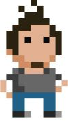

{sample: true}
# Welkom

## Over de bronnen

Dit boek is het resultaat van bijna een decennia C# doceren aan de AP Hogeschool (eerst nog Hogeschool Antwerpen, dan Artesis Hogeschool, dan Artesis Plantijn Hogeschool...). De eerste schrijfsels verschenen op een eigen gehoste blog ("Code van 1001 Nacht", die ondertussen ter ziele is gegaan) en vervolgens kreeg deze een iets strakker, eenduidige vorm als gitbook cursus. Deze cursus, alsook een hele resem oefeningen en andere nuttige extra's kan je terugvinden op ([timdams.com/ziescherp](https://timdams.com/ziescherp/)). De inhoud van die cursus loopt integraal gelijk aan die van dit boek. Uiteraard is de kans bestaande dat er in de online versie ondertussen weer wat minder schrijffoutjes staan. 

{blurb, class: tip}
Deze cursus wordt onder de Creative Commons 4.0 licentie uitgebracht. Dat wil zeggen dat u gerust die cursus mag 'plunderen' voor eigen gebruik in bijvoorbeeld eigen lessen. Uiteraard mag dit onder de voorwaarde dat u duidelijk de originele bron vermeld én er niets aan verdiend. 
De volledige in markdown geschreven broncode voor de cursus (en dus ook grotendeels dit boek) kan u forken op [github](https://github.com/timdams/csharpbook).
{/blurb}

Waarom deze korte historiek? Wel, de kans is bestaande dat er hier en daar in dit boek flarden tekst, code voorbeelden, of oefeningen niet origineel de mijne zijn. Ik heb getracht zo goed mogelijk aan te geven wat van waar komt, maar als ik toch iets vergeten ben, aarzel dan niet om me er op te wijzen. Voor de volledigheid hier enkele van de boeken, sites of andere bronnen waar doorheen de jaren "inspiratie" uit werd gehaald:

* Volgenden boeken:
  * Microsoft Visual C# 2010 - An Introduction To Object-Oriented Programming van Joyce Farrell (ISBN: 9781111529758)
  * Programmeren in C# van Douglass Bell, Mike Parr en Kris Hermans (ISBN: 9789043036139)
* Oefeningen uit de voortreffelijke website [c-sharp.be](https://www.c-sharp.be/) waarvan ik geen flauw benul heb wie deze onderhoudt.
* Sommige oefeningen en onderdelen komen uit  de cursus "Programmeren" van collega Olga Coutrin van de opleiding Toegepaste Informatica van de AP Hogeschool.

### Benodigdheden

Alle codevoorbeelden in deze cursus kan je zelf (na)maken met de gratis  **Visual Studio 2019 Community** editie die je kan downloaden op [visualstudio.microsoft.com/vs/](https://visualstudio.microsoft.com/vs/)

{pagebreak}

## Dankwoord

Aardig wat mensen, grotendeels studenten van 1EA (Professionele Bachelor Elektronica ICT van de AP Hogeschool, academiejaar 2019-2020) hebben me met deze cursus geholpen. Hen allemaal afzonderlijk bedanken zou me een extra pagina kosten, toch wil ik graag volgende mensen uitdrukkelijk in de bloemetjes zetten voor hun inbreng: Ruben Simons,  Ailko Claeys, Kevin  Van Driel en Lennert Van Riel . Zonder hen zou dit boek veel meer fouten bevatten en niet de opbouw hebben die hij nu heeft. Indien er toch nog foutjes instaan komt dat uiteraard volledig door mezelf! Een speciale dank ook aan Maarten Wachters die de originele pixel-art van me maakte waar ik vervolgens enkele varianten op heb gemaakt! Ook een bloem voor collega Coutrin om de ondankbare taak op zich te nemen mijn vele dt-fouten eruit te halen.

Indien bepaalde hoofdstukken of onderdelen niet duidelijk zijn of fouten bevatten, aarzel dan niet om me te contacteren. Normaal gezien zijn alle tekst en afbeeldingen de mijne, tenzij ik anders vermeld. Uiteraard maak ik soms fouten, als je dus een niet geattribueerde tekst of afbeelding ontdekt, aarzel dan niet om me te contacteren.

{sample: false}